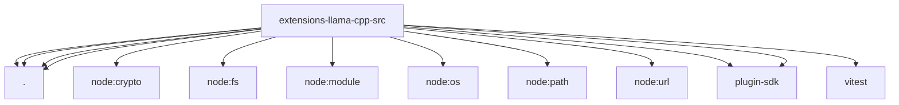

# Imports

[← Back to MODULE](MODULE.md) | [← Back to INDEX](../../INDEX.md)

## Dependency Graph

## External Dependencies

Dependencies from other modules:

- `./defaults.js`
- `./inference-provider.js`
- `./node-llama.runtime.js`
- `./setup.js`
- `node:crypto`
- `node:fs/promises`
- `node:module`
- `node:os`
- `node:path`
- `node:url`
- `openclaw/plugin-sdk/llm`
- `openclaw/plugin-sdk/memory-core-host-engine-embeddings`
- `vitest`
