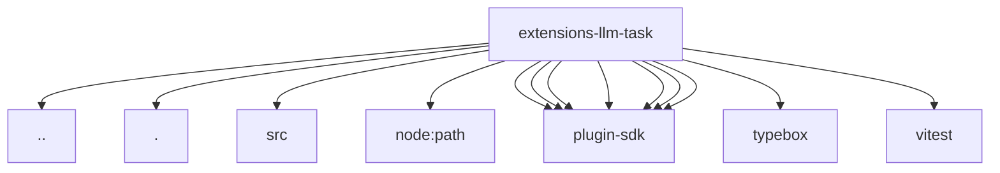

# Imports

[← Back to MODULE](MODULE.md) | [← Back to INDEX](../../INDEX.md)

## Dependency Graph

## External Dependencies

Dependencies from other modules:

- `../api.js`
- `./llm-task-tool.js`
- `./src/llm-task-tool.js`
- `node:path`
- `openclaw/plugin-sdk/agent-runtime`
- `openclaw/plugin-sdk/channel-actions`
- `openclaw/plugin-sdk/command-auth-native`
- `openclaw/plugin-sdk/json-schema-runtime`
- `openclaw/plugin-sdk/param-readers`
- `openclaw/plugin-sdk/string-coerce-runtime`
- `openclaw/plugin-sdk/tool-plugin`
- `typebox`
- `vitest`
