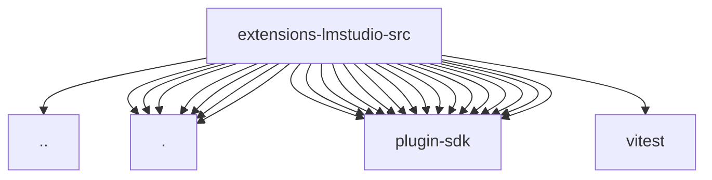

# Imports

[← Back to MODULE](MODULE.md) | [← Back to INDEX](../../INDEX.md)

## Dependency Graph

## External Dependencies

Dependencies from other modules:

- `../memory-embedding-adapter.js`
- `./defaults.js`
- `./embedding-provider.js`
- `./models.fetch.js`
- `./models.js`
- `./provider-auth.js`
- `./runtime.js`
- `./setup.js`
- `openclaw/plugin-sdk/llm`
- `openclaw/plugin-sdk/logging-core`
- `openclaw/plugin-sdk/memory-core-host-engine-embeddings`
- `openclaw/plugin-sdk/memory-core-host-secret`
- `openclaw/plugin-sdk/number-runtime`
- `openclaw/plugin-sdk/provider-auth`
- `openclaw/plugin-sdk/provider-auth-runtime`
- `openclaw/plugin-sdk/provider-http`
- `openclaw/plugin-sdk/provider-model-shared`
- `openclaw/plugin-sdk/provider-onboard`
- `openclaw/plugin-sdk/provider-setup`
- `openclaw/plugin-sdk/provider-stream-shared`
- `openclaw/plugin-sdk/secret-input-runtime`
- `openclaw/plugin-sdk/setup`
- `openclaw/plugin-sdk/ssrf-runtime`
- `openclaw/plugin-sdk/string-coerce-runtime`
- `vitest`
