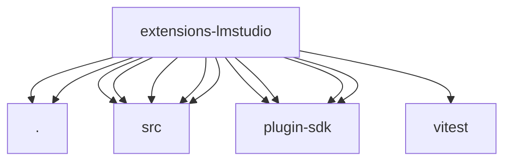

# Imports

[← Back to MODULE](MODULE.md) | [← Back to INDEX](../../INDEX.md)

## Dependency Graph

## External Dependencies

Dependencies from other modules:

- `./index.js`
- `./memory-embedding-adapter.js`
- `./src/defaults.js`
- `./src/embedding-provider.js`
- `./src/models.js`
- `./src/provider-auth.js`
- `./src/stream.js`
- `openclaw/plugin-sdk/memory-core-host-engine-embeddings`
- `openclaw/plugin-sdk/plugin-entry`
- `openclaw/plugin-sdk/plugin-test-runtime`
- `openclaw/plugin-sdk/provider-auth`
- `vitest`
