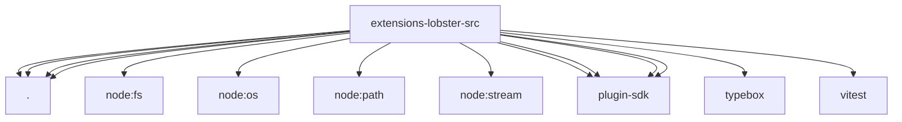

# Imports

[← Back to MODULE](MODULE.md) | [← Back to INDEX](../../INDEX.md)

## Dependency Graph

## External Dependencies

Dependencies from other modules:

- `./lobster-runner.js`
- `./lobster-taskflow.js`
- `./lobster-tool.js`
- `./taskflow-test-helpers.js`
- `node:fs/promises`
- `node:os`
- `node:path`
- `node:stream`
- `openclaw/plugin-sdk/channel-actions`
- `openclaw/plugin-sdk/param-readers`
- `openclaw/plugin-sdk/plugin-test-api`
- `openclaw/plugin-sdk/tool-results`
- `typebox`
- `vitest`
