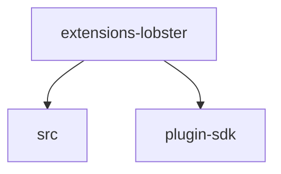

# Module: extensions/lobster

[← Back to INDEX](../../INDEX.md)

**Type:** js/ts | **Files:** 2

**Entry point:** `extensions/lobster/index.ts`

## Files

| File | Lines | Large |
| ---- | ----- | ----- |
| `extensions/lobster/index.ts` | 25 |  |
| `extensions/lobster/runtime-api.ts` | 13 |  |

## Child Modules

- [extensions-lobster-src](../extensions-lobster-src/MODULE.md)

---

## External Dependencies

Dependencies from other modules:

- `./src/lobster-tool.js`
- `openclaw/plugin-sdk/plugin-entry`
