# Imports

[← Back to MODULE](MODULE.md) | [← Back to INDEX](../../INDEX.md)

## Dependency Graph

```mermaid
graph TD
    extensions_matrix_src_matrix_actions[extensions-matrix-src-matrix-actions] --> __[..]
    extensions_matrix_src_matrix_actions[extensions-matrix-src-matrix-actions] --> __[..]
    extensions_matrix_src_matrix_actions[extensions-matrix-src-matrix-actions] --> __[..]
    extensions_matrix_src_matrix_actions[extensions-matrix-src-matrix-actions] --> __[..]
    extensions_matrix_src_matrix_actions[extensions-matrix-src-matrix-actions] --> __[..]
    extensions_matrix_src_matrix_actions[extensions-matrix-src-matrix-actions] --> __[..]
    extensions_matrix_src_matrix_actions[extensions-matrix-src-matrix-actions] --> __[..]
    extensions_matrix_src_matrix_actions[extensions-matrix-src-matrix-actions] --> __[..]
    extensions_matrix_src_matrix_actions[extensions-matrix-src-matrix-actions] --> __[..]
    extensions_matrix_src_matrix_actions[extensions-matrix-src-matrix-actions] --> __[..]
    extensions_matrix_src_matrix_actions[extensions-matrix-src-matrix-actions] --> __[..]
    extensions_matrix_src_matrix_actions[extensions-matrix-src-matrix-actions] --> __[..]
    extensions_matrix_src_matrix_actions[extensions-matrix-src-matrix-actions] --> _[.]
    extensions_matrix_src_matrix_actions[extensions-matrix-src-matrix-actions] --> _[.]
    extensions_matrix_src_matrix_actions[extensions-matrix-src-matrix-actions] --> _[.]
    extensions_matrix_src_matrix_actions[extensions-matrix-src-matrix-actions] --> _[.]
    extensions_matrix_src_matrix_actions[extensions-matrix-src-matrix-actions] --> _[.]
    extensions_matrix_src_matrix_actions[extensions-matrix-src-matrix-actions] --> _[.]
    extensions_matrix_src_matrix_actions[extensions-matrix-src-matrix-actions] --> _[.]
    extensions_matrix_src_matrix_actions[extensions-matrix-src-matrix-actions] --> _[.]
    extensions_matrix_src_matrix_actions[extensions-matrix-src-matrix-actions] --> _[.]
    extensions_matrix_src_matrix_actions[extensions-matrix-src-matrix-actions] --> node_timers[node:timers]
    extensions_matrix_src_matrix_actions[extensions-matrix-src-matrix-actions] --> plugin_sdk[plugin-sdk]
    extensions_matrix_src_matrix_actions[extensions-matrix-src-matrix-actions] --> plugin_sdk[plugin-sdk]
    extensions_matrix_src_matrix_actions[extensions-matrix-src-matrix-actions] --> plugin_sdk[plugin-sdk]
    extensions_matrix_src_matrix_actions[extensions-matrix-src-matrix-actions] --> vitest[vitest]
```

## External Dependencies

Dependencies from other modules:

- `../../runtime.js`
- `../client-bootstrap.js`
- `../client-resolver.test-helpers.js`
- `../device-health.js`
- `../encryption-guidance.js`
- `../errors.js`
- `../media-text.js`
- `../poll-summary.js`
- `../poll-types.js`
- `../profile.js`
- `../reaction-common.js`
- `../send.js`
- `./client.js`
- `./limits.js`
- `./messages.js`
- `./pins.js`
- `./polls.js`
- `./reactions.js`
- `./room.js`
- `./summary.js`
- `./types.js`
- `node:timers/promises`
- `openclaw/plugin-sdk/number-runtime`
- `openclaw/plugin-sdk/plugin-config-runtime`
- `openclaw/plugin-sdk/string-coerce-runtime`
- `vitest`
