# Imports

[← Back to MODULE](MODULE.md) | [← Back to INDEX](../../INDEX.md)

## Dependency Graph

```mermaid
graph TD
    extensions_matrix_src_matrix_client[extensions-matrix-src-matrix-client] --> __[..]
    extensions_matrix_src_matrix_client[extensions-matrix-src-matrix-client] --> __[..]
    extensions_matrix_src_matrix_client[extensions-matrix-src-matrix-client] --> __[..]
    extensions_matrix_src_matrix_client[extensions-matrix-src-matrix-client] --> __[..]
    extensions_matrix_src_matrix_client[extensions-matrix-src-matrix-client] --> __[..]
    extensions_matrix_src_matrix_client[extensions-matrix-src-matrix-client] --> __[..]
    extensions_matrix_src_matrix_client[extensions-matrix-src-matrix-client] --> __[..]
    extensions_matrix_src_matrix_client[extensions-matrix-src-matrix-client] --> __[..]
    extensions_matrix_src_matrix_client[extensions-matrix-src-matrix-client] --> __[..]
    extensions_matrix_src_matrix_client[extensions-matrix-src-matrix-client] --> __[..]
    extensions_matrix_src_matrix_client[extensions-matrix-src-matrix-client] --> __[..]
    extensions_matrix_src_matrix_client[extensions-matrix-src-matrix-client] --> sdk[sdk]
    extensions_matrix_src_matrix_client[extensions-matrix-src-matrix-client] --> __[..]
    extensions_matrix_src_matrix_client[extensions-matrix-src-matrix-client] --> __[..]
    extensions_matrix_src_matrix_client[extensions-matrix-src-matrix-client] --> _[.]
    extensions_matrix_src_matrix_client[extensions-matrix-src-matrix-client] --> _[.]
    extensions_matrix_src_matrix_client[extensions-matrix-src-matrix-client] --> _[.]
    extensions_matrix_src_matrix_client[extensions-matrix-src-matrix-client] --> _[.]
    extensions_matrix_src_matrix_client[extensions-matrix-src-matrix-client] --> _[.]
    extensions_matrix_src_matrix_client[extensions-matrix-src-matrix-client] --> _[.]
    extensions_matrix_src_matrix_client[extensions-matrix-src-matrix-client] --> _[.]
    extensions_matrix_src_matrix_client[extensions-matrix-src-matrix-client] --> _[.]
    extensions_matrix_src_matrix_client[extensions-matrix-src-matrix-client] --> lib[lib]
    extensions_matrix_src_matrix_client[extensions-matrix-src-matrix-client] --> lib[lib]
    extensions_matrix_src_matrix_client[extensions-matrix-src-matrix-client] --> node_crypto[node:crypto]
    extensions_matrix_src_matrix_client[extensions-matrix-src-matrix-client] --> node_fs[node:fs]
    extensions_matrix_src_matrix_client[extensions-matrix-src-matrix-client] --> node_fs[node:fs]
    extensions_matrix_src_matrix_client[extensions-matrix-src-matrix-client] --> node_os[node:os]
    extensions_matrix_src_matrix_client[extensions-matrix-src-matrix-client] --> node_path[node:path]
    extensions_matrix_src_matrix_client[extensions-matrix-src-matrix-client] --> plugin_sdk[plugin-sdk]
    extensions_matrix_src_matrix_client[extensions-matrix-src-matrix-client] --> plugin_sdk[plugin-sdk]
    extensions_matrix_src_matrix_client[extensions-matrix-src-matrix-client] --> plugin_sdk[plugin-sdk]
    extensions_matrix_src_matrix_client[extensions-matrix-src-matrix-client] --> plugin_sdk[plugin-sdk]
    extensions_matrix_src_matrix_client[extensions-matrix-src-matrix-client] --> plugin_sdk[plugin-sdk]
    extensions_matrix_src_matrix_client[extensions-matrix-src-matrix-client] --> plugin_sdk[plugin-sdk]
    extensions_matrix_src_matrix_client[extensions-matrix-src-matrix-client] --> plugin_sdk[plugin-sdk]
    extensions_matrix_src_matrix_client[extensions-matrix-src-matrix-client] --> plugin_sdk[plugin-sdk]
    extensions_matrix_src_matrix_client[extensions-matrix-src-matrix-client] --> plugin_sdk[plugin-sdk]
    extensions_matrix_src_matrix_client[extensions-matrix-src-matrix-client] --> plugin_sdk[plugin-sdk]
    extensions_matrix_src_matrix_client[extensions-matrix-src-matrix-client] --> plugin_sdk[plugin-sdk]
    extensions_matrix_src_matrix_client[extensions-matrix-src-matrix-client] --> vitest[vitest]
```

## External Dependencies

Dependencies from other modules:

- `../../account-selection.js`
- `../../auth-precedence.js`
- `../../env-vars.js`
- `../../record-shared.js`
- `../../runtime.js`
- `../../storage-paths.js`
- `../../test-runtime.js`
- `../account-config.js`
- `../async-lock.js`
- `../config-paths.js`
- `../crypto-state-store.js`
- `../sdk/logger.js`
- `../sqlite-state.js`
- `../startup-abort.js`
- `./config-runtime-api.js`
- `./config.js`
- `./env-auth.js`
- `./file-sync-store.js`
- `./logging.js`
- `./private-network-host.js`
- `./storage.js`
- `./url-validation.js`
- `matrix-js-sdk/lib/logger.js`
- `matrix-js-sdk/lib/matrix.js`
- `node:crypto`
- `node:fs`
- `node:fs/promises`
- `node:os`
- `node:path`
- `openclaw/plugin-sdk/account-id`
- `openclaw/plugin-sdk/error-runtime`
- `openclaw/plugin-sdk/json-store`
- `openclaw/plugin-sdk/lazy-runtime`
- `openclaw/plugin-sdk/number-runtime`
- `openclaw/plugin-sdk/plugin-config-runtime`
- `openclaw/plugin-sdk/plugin-state-test-runtime`
- `openclaw/plugin-sdk/retry-runtime`
- `openclaw/plugin-sdk/secret-input-runtime`
- `openclaw/plugin-sdk/ssrf-runtime`
- `openclaw/plugin-sdk/string-coerce-runtime`
- `vitest`
