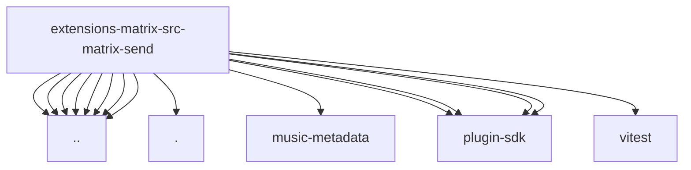

# Imports

[← Back to MODULE](MODULE.md) | [← Back to INDEX](../../INDEX.md)

## Dependency Graph

## External Dependencies

Dependencies from other modules:

- `../../runtime.js`
- `../account-config.js`
- `../client-resolver.test-helpers.js`
- `../direct-management.js`
- `../direct-room.js`
- `../format.js`
- `../reaction-common.js`
- `../target-ids.js`
- `./types.js`
- `music-metadata`
- `openclaw/plugin-sdk/lazy-runtime`
- `openclaw/plugin-sdk/media-runtime`
- `openclaw/plugin-sdk/plugin-config-runtime`
- `openclaw/plugin-sdk/string-coerce-runtime`
- `vitest`
