# Imports

[← Back to MODULE](MODULE.md) | [← Back to INDEX](../../INDEX.md)

## Dependency Graph

```mermaid
graph TD
    extensions_mattermost_src[extensions-mattermost-src] --> __[..]
    extensions_mattermost_src[extensions-mattermost-src] --> __[..]
    extensions_mattermost_src[extensions-mattermost-src] --> _[.]
    extensions_mattermost_src[extensions-mattermost-src] --> _[.]
    extensions_mattermost_src[extensions-mattermost-src] --> _[.]
    extensions_mattermost_src[extensions-mattermost-src] --> _[.]
    extensions_mattermost_src[extensions-mattermost-src] --> _[.]
    extensions_mattermost_src[extensions-mattermost-src] --> _[.]
    extensions_mattermost_src[extensions-mattermost-src] --> _[.]
    extensions_mattermost_src[extensions-mattermost-src] --> _[.]
    extensions_mattermost_src[extensions-mattermost-src] --> _[.]
    extensions_mattermost_src[extensions-mattermost-src] --> _[.]
    extensions_mattermost_src[extensions-mattermost-src] --> _[.]
    extensions_mattermost_src[extensions-mattermost-src] --> mattermost[mattermost]
    extensions_mattermost_src[extensions-mattermost-src] --> mattermost[mattermost]
    extensions_mattermost_src[extensions-mattermost-src] --> mattermost[mattermost]
    extensions_mattermost_src[extensions-mattermost-src] --> mattermost[mattermost]
    extensions_mattermost_src[extensions-mattermost-src] --> mattermost[mattermost]
    extensions_mattermost_src[extensions-mattermost-src] --> mattermost[mattermost]
    extensions_mattermost_src[extensions-mattermost-src] --> mattermost[mattermost]
    extensions_mattermost_src[extensions-mattermost-src] --> _[.]
    extensions_mattermost_src[extensions-mattermost-src] --> _[.]
    extensions_mattermost_src[extensions-mattermost-src] --> _[.]
    extensions_mattermost_src[extensions-mattermost-src] --> _[.]
    extensions_mattermost_src[extensions-mattermost-src] --> _[.]
    extensions_mattermost_src[extensions-mattermost-src] --> _[.]
    extensions_mattermost_src[extensions-mattermost-src] --> _[.]
    extensions_mattermost_src[extensions-mattermost-src] --> _[.]
    extensions_mattermost_src[extensions-mattermost-src] --> _[.]
    extensions_mattermost_src[extensions-mattermost-src] --> _[.]
    extensions_mattermost_src[extensions-mattermost-src] --> plugin_sdk[plugin-sdk]
    extensions_mattermost_src[extensions-mattermost-src] --> plugin_sdk[plugin-sdk]
    extensions_mattermost_src[extensions-mattermost-src] --> plugin_sdk[plugin-sdk]
    extensions_mattermost_src[extensions-mattermost-src] --> plugin_sdk[plugin-sdk]
    extensions_mattermost_src[extensions-mattermost-src] --> plugin_sdk[plugin-sdk]
    extensions_mattermost_src[extensions-mattermost-src] --> plugin_sdk[plugin-sdk]
    extensions_mattermost_src[extensions-mattermost-src] --> plugin_sdk[plugin-sdk]
    extensions_mattermost_src[extensions-mattermost-src] --> plugin_sdk[plugin-sdk]
    extensions_mattermost_src[extensions-mattermost-src] --> plugin_sdk[plugin-sdk]
    extensions_mattermost_src[extensions-mattermost-src] --> plugin_sdk[plugin-sdk]
    extensions_mattermost_src[extensions-mattermost-src] --> plugin_sdk[plugin-sdk]
    extensions_mattermost_src[extensions-mattermost-src] --> plugin_sdk[plugin-sdk]
    extensions_mattermost_src[extensions-mattermost-src] --> plugin_sdk[plugin-sdk]
    extensions_mattermost_src[extensions-mattermost-src] --> plugin_sdk[plugin-sdk]
    extensions_mattermost_src[extensions-mattermost-src] --> plugin_sdk[plugin-sdk]
    extensions_mattermost_src[extensions-mattermost-src] --> plugin_sdk[plugin-sdk]
    extensions_mattermost_src[extensions-mattermost-src] --> plugin_sdk[plugin-sdk]
    extensions_mattermost_src[extensions-mattermost-src] --> plugin_sdk[plugin-sdk]
    extensions_mattermost_src[extensions-mattermost-src] --> plugin_sdk[plugin-sdk]
    extensions_mattermost_src[extensions-mattermost-src] --> plugin_sdk[plugin-sdk]
    extensions_mattermost_src[extensions-mattermost-src] --> plugin_sdk[plugin-sdk]
    extensions_mattermost_src[extensions-mattermost-src] --> plugin_sdk[plugin-sdk]
    extensions_mattermost_src[extensions-mattermost-src] --> plugin_sdk[plugin-sdk]
    extensions_mattermost_src[extensions-mattermost-src] --> plugin_sdk[plugin-sdk]
    extensions_mattermost_src[extensions-mattermost-src] --> plugin_sdk[plugin-sdk]
    extensions_mattermost_src[extensions-mattermost-src] --> plugin_sdk[plugin-sdk]
    extensions_mattermost_src[extensions-mattermost-src] --> plugin_sdk[plugin-sdk]
    extensions_mattermost_src[extensions-mattermost-src] --> plugin_sdk[plugin-sdk]
    extensions_mattermost_src[extensions-mattermost-src] --> plugin_sdk[plugin-sdk]
    extensions_mattermost_src[extensions-mattermost-src] --> plugin_sdk[plugin-sdk]
    extensions_mattermost_src[extensions-mattermost-src] --> plugin_sdk[plugin-sdk]
    extensions_mattermost_src[extensions-mattermost-src] --> plugin_sdk[plugin-sdk]
    extensions_mattermost_src[extensions-mattermost-src] --> plugin_sdk[plugin-sdk]
    extensions_mattermost_src[extensions-mattermost-src] --> vitest[vitest]
    extensions_mattermost_src[extensions-mattermost-src] --> zod[zod]
```

## External Dependencies

Dependencies from other modules:

- `../channel-plugin-api.js`
- `../runtime-api.js`
- `./approval-auth.js`
- `./channel-api.js`
- `./channel-config-shared.js`
- `./channel.js`
- `./config-schema-core.js`
- `./config-surface.js`
- `./config-ui-hints.js`
- `./doctor-contract.js`
- `./doctor.js`
- `./gateway-auth-bypass.js`
- `./group-mentions.js`
- `./mattermost/accounts.js`
- `./mattermost/client.js`
- `./mattermost/draft-stream.js`
- `./mattermost/monitor-context.js`
- `./mattermost/monitor-draft-delivery.js`
- `./mattermost/reactions.test-helpers.js`
- `./mattermost/reply-delivery.js`
- `./normalize.js`
- `./runtime.js`
- `./secret-contract.js`
- `./secret-input.js`
- `./session-route.js`
- `./setup-core.js`
- `./setup-surface.js`
- `./setup.accounts.runtime.js`
- `./setup.client.runtime.js`
- `./setup.secret-input.runtime.js`
- `openclaw/plugin-sdk/account-helpers`
- `openclaw/plugin-sdk/account-id`
- `openclaw/plugin-sdk/allow-from`
- `openclaw/plugin-sdk/approval-auth-runtime`
- `openclaw/plugin-sdk/channel-config-helpers`
- `openclaw/plugin-sdk/channel-config-schema`
- `openclaw/plugin-sdk/channel-contract-testing`
- `openclaw/plugin-sdk/channel-core`
- `openclaw/plugin-sdk/channel-outbound`
- `openclaw/plugin-sdk/channel-pairing`
- `openclaw/plugin-sdk/channel-policy`
- `openclaw/plugin-sdk/channel-secret-basic-runtime`
- `openclaw/plugin-sdk/channel-send-result`
- `openclaw/plugin-sdk/channel-test-helpers`
- `openclaw/plugin-sdk/core`
- `openclaw/plugin-sdk/directory-runtime`
- `openclaw/plugin-sdk/extension-shared`
- `openclaw/plugin-sdk/interactive-runtime`
- `openclaw/plugin-sdk/lazy-runtime`
- `openclaw/plugin-sdk/markdown-table-runtime`
- `openclaw/plugin-sdk/plugin-test-api`
- `openclaw/plugin-sdk/plugin-test-runtime`
- `openclaw/plugin-sdk/reply-chunking`
- `openclaw/plugin-sdk/reply-payload`
- `openclaw/plugin-sdk/runtime-doctor`
- `openclaw/plugin-sdk/runtime-store`
- `openclaw/plugin-sdk/setup`
- `openclaw/plugin-sdk/setup-runtime`
- `openclaw/plugin-sdk/ssrf-runtime`
- `openclaw/plugin-sdk/status-helpers`
- `openclaw/plugin-sdk/string-coerce-runtime`
- `openclaw/plugin-sdk/test-env`
- `openclaw/plugin-sdk/text-chunking`
- `vitest`
- `zod`
