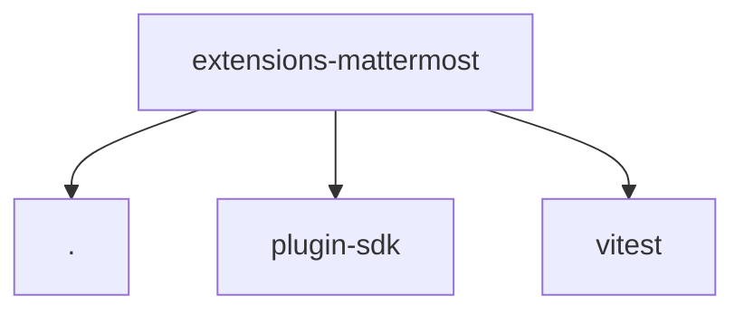

# Module: extensions/mattermost

[← Back to INDEX](../../INDEX.md)

**Type:** js/ts | **Files:** 12

**Entry point:** `extensions/mattermost/index.ts`

## Files

| File | Lines | Large |
| ---- | ----- | ----- |
| `extensions/mattermost/api.test.ts` | 9 |  |
| `extensions/mattermost/api.ts` | 3 |  |
| `extensions/mattermost/channel-plugin-api.ts` | 4 |  |
| `extensions/mattermost/channel-plugin-runtime.ts` | 4 |  |
| `extensions/mattermost/doctor-contract-api.ts` | 2 |  |
| `extensions/mattermost/gateway-auth-api.ts` | 2 |  |
| `extensions/mattermost/index.ts` | 38 |  |
| `extensions/mattermost/policy-api.ts` | 2 |  |
| `extensions/mattermost/runtime-api.ts` | 84 |  |
| `extensions/mattermost/secret-contract-api.ts` | 6 |  |
| `extensions/mattermost/setup-entry.ts` | 14 |  |
| `extensions/mattermost/slash-route-api.ts` | 2 |  |

## Child Modules

- [extensions-mattermost-src](../extensions-mattermost-src/MODULE.md)

---

## External Dependencies

Dependencies from other modules:

- `./api.js`
- `openclaw/plugin-sdk/channel-entry-contract`
- `vitest`
