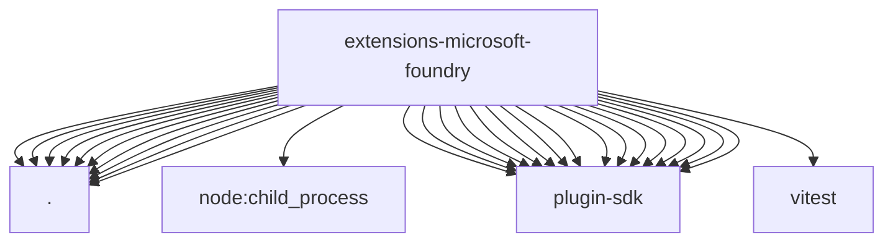

# Imports

[← Back to MODULE](MODULE.md) | [← Back to INDEX](../../INDEX.md)

## Dependency Graph

## External Dependencies

Dependencies from other modules:

- `./auth.js`
- `./cli.js`
- `./image-generation-provider.js`
- `./index.js`
- `./onboard.js`
- `./provider.js`
- `./runtime.js`
- `./shared-runtime.js`
- `./shared.js`
- `./test-support.js`
- `node:child_process`
- `openclaw/plugin-sdk/error-runtime`
- `openclaw/plugin-sdk/expect-runtime`
- `openclaw/plugin-sdk/image-generation`
- `openclaw/plugin-sdk/media-runtime`
- `openclaw/plugin-sdk/number-runtime`
- `openclaw/plugin-sdk/plugin-entry`
- `openclaw/plugin-sdk/plugin-test-api`
- `openclaw/plugin-sdk/process-runtime`
- `openclaw/plugin-sdk/provider-auth`
- `openclaw/plugin-sdk/provider-auth-runtime`
- `openclaw/plugin-sdk/provider-http`
- `openclaw/plugin-sdk/provider-model-shared`
- `openclaw/plugin-sdk/provider-stream-family`
- `openclaw/plugin-sdk/ssrf-runtime`
- `openclaw/plugin-sdk/string-coerce-runtime`
- `openclaw/plugin-sdk/text-utility-runtime`
- `vitest`
