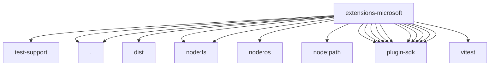

# Imports

[← Back to MODULE](MODULE.md) | [← Back to INDEX](../../INDEX.md)

## Dependency Graph

## External Dependencies

Dependencies from other modules:

- `../test-support/debug-proxy-env-test-helpers.js`
- `./speech-provider.js`
- `./tts.js`
- `node-edge-tts/dist/drm.js`
- `node:fs`
- `node:fs/promises`
- `node:os`
- `node:path`
- `openclaw/plugin-sdk/media-runtime`
- `openclaw/plugin-sdk/plugin-entry`
- `openclaw/plugin-sdk/provider-http`
- `openclaw/plugin-sdk/proxy-capture`
- `openclaw/plugin-sdk/security-runtime`
- `openclaw/plugin-sdk/speech`
- `openclaw/plugin-sdk/ssrf-runtime`
- `openclaw/plugin-sdk/string-coerce-runtime`
- `openclaw/plugin-sdk/temp-path`
- `openclaw/plugin-sdk/test-live`
- `vitest`
