# Imports

[← Back to MODULE](MODULE.md) | [← Back to INDEX](../../INDEX.md)

## Dependency Graph

```mermaid
graph TD
    extensions_migrate_claude[extensions-migrate-claude] --> _[.]
    extensions_migrate_claude[extensions-migrate-claude] --> _[.]
    extensions_migrate_claude[extensions-migrate-claude] --> _[.]
    extensions_migrate_claude[extensions-migrate-claude] --> _[.]
    extensions_migrate_claude[extensions-migrate-claude] --> _[.]
    extensions_migrate_claude[extensions-migrate-claude] --> _[.]
    extensions_migrate_claude[extensions-migrate-claude] --> _[.]
    extensions_migrate_claude[extensions-migrate-claude] --> _[.]
    extensions_migrate_claude[extensions-migrate-claude] --> _[.]
    extensions_migrate_claude[extensions-migrate-claude] --> test[test]
    extensions_migrate_claude[extensions-migrate-claude] --> node_crypto[node:crypto]
    extensions_migrate_claude[extensions-migrate-claude] --> node_fs[node:fs]
    extensions_migrate_claude[extensions-migrate-claude] --> node_os[node:os]
    extensions_migrate_claude[extensions-migrate-claude] --> node_path[node:path]
    extensions_migrate_claude[extensions-migrate-claude] --> plugin_sdk[plugin-sdk]
    extensions_migrate_claude[extensions-migrate-claude] --> plugin_sdk[plugin-sdk]
    extensions_migrate_claude[extensions-migrate-claude] --> plugin_sdk[plugin-sdk]
    extensions_migrate_claude[extensions-migrate-claude] --> plugin_sdk[plugin-sdk]
    extensions_migrate_claude[extensions-migrate-claude] --> plugin_sdk[plugin-sdk]
    extensions_migrate_claude[extensions-migrate-claude] --> plugin_sdk[plugin-sdk]
    extensions_migrate_claude[extensions-migrate-claude] --> plugin_sdk[plugin-sdk]
    extensions_migrate_claude[extensions-migrate-claude] --> vitest[vitest]
```

## External Dependencies

Dependencies from other modules:

- `./apply.js`
- `./config.js`
- `./helpers.js`
- `./memory.js`
- `./plan.js`
- `./provider.js`
- `./skills.js`
- `./source.js`
- `./targets.js`
- `./test/provider-helpers.js`
- `node:crypto`
- `node:fs/promises`
- `node:os`
- `node:path`
- `openclaw/plugin-sdk/migration`
- `openclaw/plugin-sdk/migration-runtime`
- `openclaw/plugin-sdk/plugin-entry`
- `openclaw/plugin-sdk/security-runtime`
- `openclaw/plugin-sdk/string-coerce-runtime`
- `openclaw/plugin-sdk/temp-path`
- `openclaw/plugin-sdk/text-utility-runtime`
- `vitest`
