# Imports

[← Back to MODULE](MODULE.md) | [← Back to INDEX](../../INDEX.md)

## Dependency Graph

```mermaid
graph TD
    extensions_migrate_hermes[extensions-migrate-hermes] --> _[.]
    extensions_migrate_hermes[extensions-migrate-hermes] --> _[.]
    extensions_migrate_hermes[extensions-migrate-hermes] --> _[.]
    extensions_migrate_hermes[extensions-migrate-hermes] --> _[.]
    extensions_migrate_hermes[extensions-migrate-hermes] --> _[.]
    extensions_migrate_hermes[extensions-migrate-hermes] --> _[.]
    extensions_migrate_hermes[extensions-migrate-hermes] --> _[.]
    extensions_migrate_hermes[extensions-migrate-hermes] --> _[.]
    extensions_migrate_hermes[extensions-migrate-hermes] --> _[.]
    extensions_migrate_hermes[extensions-migrate-hermes] --> _[.]
    extensions_migrate_hermes[extensions-migrate-hermes] --> _[.]
    extensions_migrate_hermes[extensions-migrate-hermes] --> _[.]
    extensions_migrate_hermes[extensions-migrate-hermes] --> _[.]
    extensions_migrate_hermes[extensions-migrate-hermes] --> _[.]
    extensions_migrate_hermes[extensions-migrate-hermes] --> _[.]
    extensions_migrate_hermes[extensions-migrate-hermes] --> _[.]
    extensions_migrate_hermes[extensions-migrate-hermes] --> _[.]
    extensions_migrate_hermes[extensions-migrate-hermes] --> _[.]
    extensions_migrate_hermes[extensions-migrate-hermes] --> _[.]
    extensions_migrate_hermes[extensions-migrate-hermes] --> _[.]
    extensions_migrate_hermes[extensions-migrate-hermes] --> _[.]
    extensions_migrate_hermes[extensions-migrate-hermes] --> test[test]
    extensions_migrate_hermes[extensions-migrate-hermes] --> dotenv[dotenv]
    extensions_migrate_hermes[extensions-migrate-hermes] --> node_crypto[node:crypto]
    extensions_migrate_hermes[extensions-migrate-hermes] --> node_fs[node:fs]
    extensions_migrate_hermes[extensions-migrate-hermes] --> node_os[node:os]
    extensions_migrate_hermes[extensions-migrate-hermes] --> node_path[node:path]
    extensions_migrate_hermes[extensions-migrate-hermes] --> node_sqlite[node:sqlite]
    extensions_migrate_hermes[extensions-migrate-hermes] --> plugin_sdk[plugin-sdk]
    extensions_migrate_hermes[extensions-migrate-hermes] --> plugin_sdk[plugin-sdk]
    extensions_migrate_hermes[extensions-migrate-hermes] --> plugin_sdk[plugin-sdk]
    extensions_migrate_hermes[extensions-migrate-hermes] --> plugin_sdk[plugin-sdk]
    extensions_migrate_hermes[extensions-migrate-hermes] --> plugin_sdk[plugin-sdk]
    extensions_migrate_hermes[extensions-migrate-hermes] --> plugin_sdk[plugin-sdk]
    extensions_migrate_hermes[extensions-migrate-hermes] --> plugin_sdk[plugin-sdk]
    extensions_migrate_hermes[extensions-migrate-hermes] --> plugin_sdk[plugin-sdk]
    extensions_migrate_hermes[extensions-migrate-hermes] --> plugin_sdk[plugin-sdk]
    extensions_migrate_hermes[extensions-migrate-hermes] --> plugin_sdk[plugin-sdk]
    extensions_migrate_hermes[extensions-migrate-hermes] --> vitest[vitest]
    extensions_migrate_hermes[extensions-migrate-hermes] --> yaml[yaml]
```

## External Dependencies

Dependencies from other modules:

- `./apply.js`
- `./auth-config.js`
- `./auth-source.js`
- `./auth.js`
- `./config-env.js`
- `./config-mcp.js`
- `./config-provider-contract.js`
- `./config-providers.js`
- `./config.js`
- `./helpers.js`
- `./index.js`
- `./items.js`
- `./memory.js`
- `./model.js`
- `./plan.js`
- `./provider.js`
- `./secret-mappings.js`
- `./secrets.js`
- `./skills.js`
- `./source.js`
- `./targets.js`
- `./test/provider-helpers.js`
- `dotenv`
- `node:crypto`
- `node:fs/promises`
- `node:os`
- `node:path`
- `node:sqlite`
- `openclaw/plugin-sdk/agent-runtime`
- `openclaw/plugin-sdk/migration`
- `openclaw/plugin-sdk/migration-runtime`
- `openclaw/plugin-sdk/plugin-entry`
- `openclaw/plugin-sdk/plugin-test-runtime`
- `openclaw/plugin-sdk/provider-auth`
- `openclaw/plugin-sdk/provider-onboard`
- `openclaw/plugin-sdk/security-runtime`
- `openclaw/plugin-sdk/string-coerce-runtime`
- `openclaw/plugin-sdk/temp-path`
- `vitest`
- `yaml`
