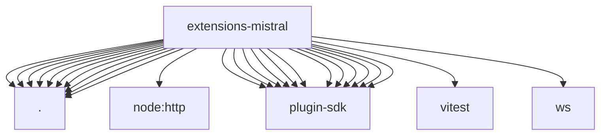

# Imports

[← Back to MODULE](MODULE.md) | [← Back to INDEX](../../INDEX.md)

## Dependency Graph

## External Dependencies

Dependencies from other modules:

- `./api.js`
- `./embedding-provider.js`
- `./index.js`
- `./media-understanding-provider.js`
- `./memory-embedding-adapter.js`
- `./model-definitions.js`
- `./onboard.js`
- `./openclaw.plugin.json`
- `./provider-catalog.js`
- `./realtime-transcription-provider.js`
- `node:http`
- `openclaw/plugin-sdk/media-understanding`
- `openclaw/plugin-sdk/memory-core-host-engine-embeddings`
- `openclaw/plugin-sdk/plugin-test-runtime`
- `openclaw/plugin-sdk/provider-catalog-shared`
- `openclaw/plugin-sdk/provider-entry`
- `openclaw/plugin-sdk/provider-onboard`
- `openclaw/plugin-sdk/provider-test-contracts`
- `openclaw/plugin-sdk/realtime-transcription`
- `openclaw/plugin-sdk/secret-input`
- `openclaw/plugin-sdk/string-coerce-runtime`
- `openclaw/plugin-sdk/test-live`
- `openclaw/plugin-sdk/test-media-understanding`
- `vitest`
- `ws`
