# Imports

[← Back to MODULE](MODULE.md) | [← Back to INDEX](../../INDEX.md)

## Dependency Graph

```mermaid
graph TD
    extensions_moonshot[extensions-moonshot] --> __[..]
    extensions_moonshot[extensions-moonshot] --> __[..]
    extensions_moonshot[extensions-moonshot] --> _[.]
    extensions_moonshot[extensions-moonshot] --> _[.]
    extensions_moonshot[extensions-moonshot] --> _[.]
    extensions_moonshot[extensions-moonshot] --> _[.]
    extensions_moonshot[extensions-moonshot] --> _[.]
    extensions_moonshot[extensions-moonshot] --> _[.]
    extensions_moonshot[extensions-moonshot] --> _[.]
    extensions_moonshot[extensions-moonshot] --> _[.]
    extensions_moonshot[extensions-moonshot] --> src[src]
    extensions_moonshot[extensions-moonshot] --> node_fs[node:fs]
    extensions_moonshot[extensions-moonshot] --> plugin_sdk[plugin-sdk]
    extensions_moonshot[extensions-moonshot] --> plugin_sdk[plugin-sdk]
    extensions_moonshot[extensions-moonshot] --> plugin_sdk[plugin-sdk]
    extensions_moonshot[extensions-moonshot] --> plugin_sdk[plugin-sdk]
    extensions_moonshot[extensions-moonshot] --> plugin_sdk[plugin-sdk]
    extensions_moonshot[extensions-moonshot] --> plugin_sdk[plugin-sdk]
    extensions_moonshot[extensions-moonshot] --> plugin_sdk[plugin-sdk]
    extensions_moonshot[extensions-moonshot] --> plugin_sdk[plugin-sdk]
    extensions_moonshot[extensions-moonshot] --> plugin_sdk[plugin-sdk]
    extensions_moonshot[extensions-moonshot] --> plugin_sdk[plugin-sdk]
    extensions_moonshot[extensions-moonshot] --> plugin_sdk[plugin-sdk]
    extensions_moonshot[extensions-moonshot] --> plugin_sdk[plugin-sdk]
    extensions_moonshot[extensions-moonshot] --> plugin_sdk[plugin-sdk]
    extensions_moonshot[extensions-moonshot] --> plugin_sdk[plugin-sdk]
    extensions_moonshot[extensions-moonshot] --> plugin_sdk[plugin-sdk]
    extensions_moonshot[extensions-moonshot] --> plugin_sdk[plugin-sdk]
    extensions_moonshot[extensions-moonshot] --> plugin_sdk[plugin-sdk]
    extensions_moonshot[extensions-moonshot] --> typebox[typebox]
    extensions_moonshot[extensions-moonshot] --> vitest[vitest]
```

## External Dependencies

Dependencies from other modules:

- `../provider-catalog.js`
- `../test-api.js`
- `./api.js`
- `./index.js`
- `./kimi-web-search-provider.js`
- `./media-understanding-provider.js`
- `./onboard.js`
- `./openclaw.plugin.json`
- `./provider-catalog.js`
- `./provider-policy-api.js`
- `./src/kimi-web-search-provider.js`
- `node:fs`
- `openclaw/plugin-sdk/lazy-runtime`
- `openclaw/plugin-sdk/llm`
- `openclaw/plugin-sdk/media-understanding`
- `openclaw/plugin-sdk/plugin-test-runtime`
- `openclaw/plugin-sdk/provider-catalog-shared`
- `openclaw/plugin-sdk/provider-entry`
- `openclaw/plugin-sdk/provider-http`
- `openclaw/plugin-sdk/provider-model-shared`
- `openclaw/plugin-sdk/provider-onboard`
- `openclaw/plugin-sdk/provider-stream-family`
- `openclaw/plugin-sdk/provider-test-contracts`
- `openclaw/plugin-sdk/provider-web-search`
- `openclaw/plugin-sdk/provider-web-search-config-contract`
- `openclaw/plugin-sdk/string-coerce-runtime`
- `openclaw/plugin-sdk/test-env`
- `openclaw/plugin-sdk/test-live`
- `openclaw/plugin-sdk/test-media-understanding`
- `typebox`
- `vitest`
