# Imports

[← Back to MODULE](MODULE.md) | [← Back to INDEX](../../INDEX.md)

## Dependency Graph

```mermaid
graph TD
    extensions_mxc_src[extensions-mxc-src] --> _[.]
    extensions_mxc_src[extensions-mxc-src] --> _[.]
    extensions_mxc_src[extensions-mxc-src] --> _[.]
    extensions_mxc_src[extensions-mxc-src] --> _[.]
    extensions_mxc_src[extensions-mxc-src] --> _[.]
    extensions_mxc_src[extensions-mxc-src] --> _[.]
    extensions_mxc_src[extensions-mxc-src] --> _[.]
    extensions_mxc_src[extensions-mxc-src] --> _[.]
    extensions_mxc_src[extensions-mxc-src] --> _[.]
    extensions_mxc_src[extensions-mxc-src] --> _[.]
    extensions_mxc_src[extensions-mxc-src] --> _[.]
    extensions_mxc_src[extensions-mxc-src] --> _[.]
    extensions_mxc_src[extensions-mxc-src] --> _[.]
    extensions_mxc_src[extensions-mxc-src] --> node_child_process[node:child_process]
    extensions_mxc_src[extensions-mxc-src] --> node_crypto[node:crypto]
    extensions_mxc_src[extensions-mxc-src] --> node_fs[node:fs]
    extensions_mxc_src[extensions-mxc-src] --> node_module[node:module]
    extensions_mxc_src[extensions-mxc-src] --> node_path[node:path]
    extensions_mxc_src[extensions-mxc-src] --> node_url[node:url]
    extensions_mxc_src[extensions-mxc-src] --> plugin_sdk[plugin-sdk]
    extensions_mxc_src[extensions-mxc-src] --> plugin_sdk[plugin-sdk]
    extensions_mxc_src[extensions-mxc-src] --> plugin_sdk[plugin-sdk]
    extensions_mxc_src[extensions-mxc-src] --> plugin_sdk[plugin-sdk]
    extensions_mxc_src[extensions-mxc-src] --> plugin_sdk[plugin-sdk]
    extensions_mxc_src[extensions-mxc-src] --> plugin_sdk[plugin-sdk]
    extensions_mxc_src[extensions-mxc-src] --> plugin_sdk[plugin-sdk]
    extensions_mxc_src[extensions-mxc-src] --> zod[zod]
```

## External Dependencies

Dependencies from other modules:

- `./binary-resolver.js`
- `./config.js`
- `./fs-bridge.js`
- `./mxc-backend-factory.js`
- `./mxc-backend.js`
- `./mxc-container-config.js`
- `./plugin-root.js`
- `./readiness.js`
- `./sandbox-baseline.js`
- `./sandbox-policy-loader.js`
- `./windows-command.js`
- `./windows-env.js`
- `./workspace-skill-mounts.js`
- `node:child_process`
- `node:crypto`
- `node:fs`
- `node:module`
- `node:path`
- `node:url`
- `openclaw/plugin-sdk/core`
- `openclaw/plugin-sdk/extension-shared`
- `openclaw/plugin-sdk/file-access-runtime`
- `openclaw/plugin-sdk/number-runtime`
- `openclaw/plugin-sdk/process-runtime`
- `openclaw/plugin-sdk/sandbox`
- `openclaw/plugin-sdk/security-runtime`
- `zod`
