# Imports

[← Back to MODULE](MODULE.md) | [← Back to INDEX](../../INDEX.md)

## Dependency Graph

```mermaid
graph TD
    extensions_mxc_test[extensions-mxc-test] --> src[src]
    extensions_mxc_test[extensions-mxc-test] --> src[src]
    extensions_mxc_test[extensions-mxc-test] --> src[src]
    extensions_mxc_test[extensions-mxc-test] --> src[src]
    extensions_mxc_test[extensions-mxc-test] --> src[src]
    extensions_mxc_test[extensions-mxc-test] --> src[src]
    extensions_mxc_test[extensions-mxc-test] --> src[src]
    extensions_mxc_test[extensions-mxc-test] --> src[src]
    extensions_mxc_test[extensions-mxc-test] --> src[src]
    extensions_mxc_test[extensions-mxc-test] --> node_child_process[node:child_process]
    extensions_mxc_test[extensions-mxc-test] --> node_fs[node:fs]
    extensions_mxc_test[extensions-mxc-test] --> node_module[node:module]
    extensions_mxc_test[extensions-mxc-test] --> node_os[node:os]
    extensions_mxc_test[extensions-mxc-test] --> node_path[node:path]
    extensions_mxc_test[extensions-mxc-test] --> node_url[node:url]
    extensions_mxc_test[extensions-mxc-test] --> plugin_sdk[plugin-sdk]
    extensions_mxc_test[extensions-mxc-test] --> plugin_sdk[plugin-sdk]
    extensions_mxc_test[extensions-mxc-test] --> vitest[vitest]
```

## External Dependencies

Dependencies from other modules:

- `../src/binary-resolver.js`
- `../src/config.js`
- `../src/mxc-backend-factory.js`
- `../src/mxc-backend.js`
- `../src/plugin-root.js`
- `../src/plugin.js`
- `../src/readiness.js`
- `../src/sandbox-baseline.js`
- `../src/sandbox-policy-loader.js`
- `node:child_process`
- `node:fs`
- `node:module`
- `node:os`
- `node:path`
- `node:url`
- `openclaw/plugin-sdk/number-runtime`
- `openclaw/plugin-sdk/security-runtime`
- `vitest`
