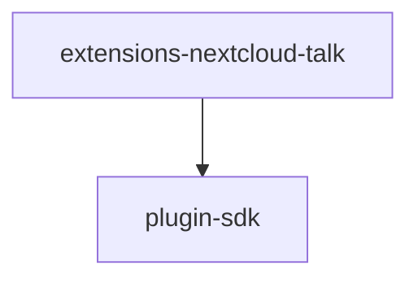

# Module: extensions/nextcloud-talk

[← Back to INDEX](../../INDEX.md)

**Type:** js/ts | **Files:** 7

**Entry point:** `extensions/nextcloud-talk/index.ts`

## Files

| File | Lines | Large |
| ---- | ----- | ----- |
| `extensions/nextcloud-talk/api.ts` | 2 |  |
| `extensions/nextcloud-talk/channel-plugin-api.ts` | 2 |  |
| `extensions/nextcloud-talk/doctor-contract-api.ts` | 2 |  |
| `extensions/nextcloud-talk/index.ts` | 21 |  |
| `extensions/nextcloud-talk/runtime-api.ts` | 29 |  |
| `extensions/nextcloud-talk/secret-contract-api.ts` | 6 |  |
| `extensions/nextcloud-talk/setup-entry.ts` | 14 |  |

## Child Modules

- [extensions-nextcloud-talk-src](../extensions-nextcloud-talk-src/MODULE.md)

---

## External Dependencies

Dependencies from other modules:

- `openclaw/plugin-sdk/channel-entry-contract`
