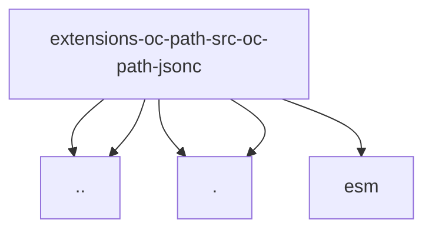

# Imports

[← Back to MODULE](MODULE.md) | [← Back to INDEX](../../INDEX.md)

## Dependency Graph

## External Dependencies

Dependencies from other modules:

- `../oc-path.js`
- `../sentinel.js`
- `./parse.js`
- `./resolve-value.js`
- `jsonc-parser/lib/esm/main.js`
