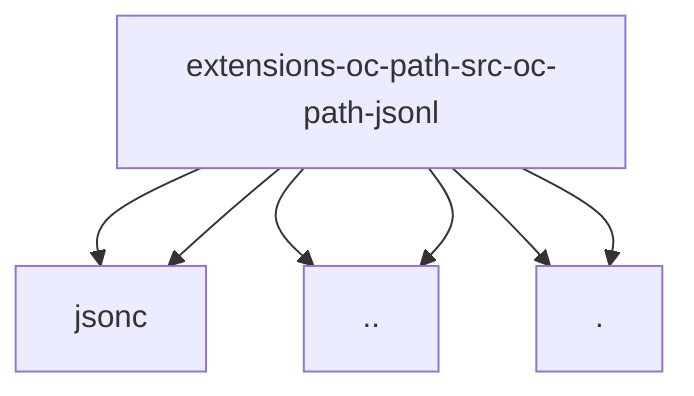

# Imports

[← Back to MODULE](MODULE.md) | [← Back to INDEX](../../INDEX.md)

## Dependency Graph

## External Dependencies

Dependencies from other modules:

- `../jsonc/parse.js`
- `../jsonc/resolve-value.js`
- `../oc-path.js`
- `../sentinel.js`
- `./emit.js`
- `./line.js`
