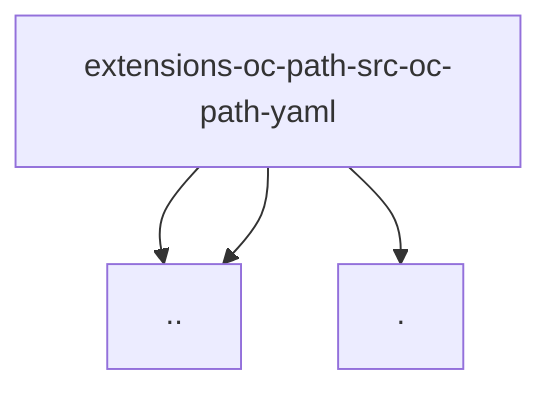

# Imports

[← Back to MODULE](MODULE.md) | [← Back to INDEX](../../INDEX.md)

## Dependency Graph

## Internal Dependencies

Dependencies within this module:

- `yaml`

## External Dependencies

Dependencies from other modules:

- `../oc-path.js`
- `../sentinel.js`
- `./resolve.js`
