# Imports

[← Back to MODULE](MODULE.md) | [← Back to INDEX](../../INDEX.md)

## Dependency Graph

```mermaid
graph TD
    extensions_oc_path_src_oc_path[extensions-oc-path-src-oc-path] --> __[..]
    extensions_oc_path_src_oc_path[extensions-oc-path-src-oc-path] --> __[..]
    extensions_oc_path_src_oc_path[extensions-oc-path-src-oc-path] --> jsonc[jsonc]
    extensions_oc_path_src_oc_path[extensions-oc-path-src-oc-path] --> jsonc[jsonc]
    extensions_oc_path_src_oc_path[extensions-oc-path-src-oc-path] --> jsonc[jsonc]
    extensions_oc_path_src_oc_path[extensions-oc-path-src-oc-path] --> jsonc[jsonc]
    extensions_oc_path_src_oc_path[extensions-oc-path-src-oc-path] --> jsonl[jsonl]
    extensions_oc_path_src_oc_path[extensions-oc-path-src-oc-path] --> jsonl[jsonl]
    extensions_oc_path_src_oc_path[extensions-oc-path-src-oc-path] --> jsonl[jsonl]
    extensions_oc_path_src_oc_path[extensions-oc-path-src-oc-path] --> jsonl[jsonl]
    extensions_oc_path_src_oc_path[extensions-oc-path-src-oc-path] --> __[..]
    extensions_oc_path_src_oc_path[extensions-oc-path-src-oc-path] --> __[..]
    extensions_oc_path_src_oc_path[extensions-oc-path-src-oc-path] --> __[..]
    extensions_oc_path_src_oc_path[extensions-oc-path-src-oc-path] --> yaml[yaml]
    extensions_oc_path_src_oc_path[extensions-oc-path-src-oc-path] --> yaml[yaml]
    extensions_oc_path_src_oc_path[extensions-oc-path-src-oc-path] --> yaml[yaml]
    extensions_oc_path_src_oc_path[extensions-oc-path-src-oc-path] --> yaml[yaml]
    extensions_oc_path_src_oc_path[extensions-oc-path-src-oc-path] --> _[.]
    extensions_oc_path_src_oc_path[extensions-oc-path-src-oc-path] --> jsonc[jsonc]
    extensions_oc_path_src_oc_path[extensions-oc-path-src-oc-path] --> jsonc[jsonc]
    extensions_oc_path_src_oc_path[extensions-oc-path-src-oc-path] --> jsonl[jsonl]
    extensions_oc_path_src_oc_path[extensions-oc-path-src-oc-path] --> jsonl[jsonl]
    extensions_oc_path_src_oc_path[extensions-oc-path-src-oc-path] --> jsonl[jsonl]
    extensions_oc_path_src_oc_path[extensions-oc-path-src-oc-path] --> jsonl[jsonl]
    extensions_oc_path_src_oc_path[extensions-oc-path-src-oc-path] --> _[.]
    extensions_oc_path_src_oc_path[extensions-oc-path-src-oc-path] --> _[.]
    extensions_oc_path_src_oc_path[extensions-oc-path-src-oc-path] --> _[.]
    extensions_oc_path_src_oc_path[extensions-oc-path-src-oc-path] --> _[.]
    extensions_oc_path_src_oc_path[extensions-oc-path-src-oc-path] --> _[.]
    extensions_oc_path_src_oc_path[extensions-oc-path-src-oc-path] --> yaml[yaml]
    extensions_oc_path_src_oc_path[extensions-oc-path-src-oc-path] --> yaml[yaml]
    extensions_oc_path_src_oc_path[extensions-oc-path-src-oc-path] --> markdown_it[markdown-it]
    extensions_oc_path_src_oc_path[extensions-oc-path-src-oc-path] --> plugin_sdk[plugin-sdk]
    extensions_oc_path_src_oc_path[extensions-oc-path-src-oc-path] --> plugin_sdk[plugin-sdk]
    extensions_oc_path_src_oc_path[extensions-oc-path-src-oc-path] --> vitest[vitest]
```

## Internal Dependencies

Dependencies within this module:

- `yaml`

## External Dependencies

Dependencies from other modules:

- `../../dispatch.js`
- `../../find.js`
- `../../jsonc/edit.js`
- `../../jsonc/emit.js`
- `../../jsonc/parse.js`
- `../../jsonc/resolve.js`
- `../../jsonl/edit.js`
- `../../jsonl/emit.js`
- `../../jsonl/parse.js`
- `../../jsonl/resolve.js`
- `../../oc-path.js`
- `../../sentinel.js`
- `../../universal.js`
- `../../yaml/edit.js`
- `../../yaml/emit.js`
- `../../yaml/parse.js`
- `../../yaml/resolve.js`
- `./edit.js`
- `./jsonc/edit.js`
- `./jsonc/resolve.js`
- `./jsonl/edit.js`
- `./jsonl/emit.js`
- `./jsonl/line.js`
- `./jsonl/resolve.js`
- `./oc-path.js`
- `./resolve.js`
- `./sentinel.js`
- `./slug.js`
- `./universal.js`
- `./yaml/edit.js`
- `./yaml/resolve.js`
- `markdown-it`
- `openclaw/plugin-sdk/expect-runtime`
- `openclaw/plugin-sdk/text-utility-runtime`
- `vitest`
