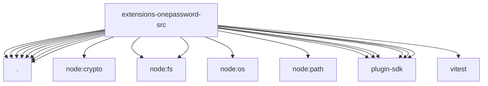

# Imports

[← Back to MODULE](MODULE.md) | [← Back to INDEX](../../INDEX.md)

## Dependency Graph

## External Dependencies

Dependencies from other modules:

- `./broker.js`
- `./cli.js`
- `./config.js`
- `./errors.js`
- `./memory-store.test-support.js`
- `./op-client.js`
- `./pending-authorization.js`
- `./tool.js`
- `node:crypto`
- `node:fs`
- `node:fs/promises`
- `node:os`
- `node:path`
- `openclaw/plugin-sdk/error-runtime`
- `openclaw/plugin-sdk/number-runtime`
- `openclaw/plugin-sdk/process-runtime`
- `openclaw/plugin-sdk/secret-file-runtime`
- `openclaw/plugin-sdk/text-utility-runtime`
- `openclaw/plugin-sdk/tool-results`
- `vitest`
