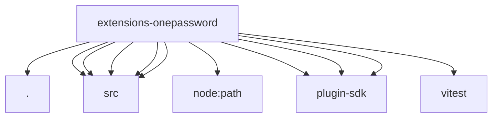

# Imports

[← Back to MODULE](MODULE.md) | [← Back to INDEX](../../INDEX.md)

## Dependency Graph

## External Dependencies

Dependencies from other modules:

- `./index.js`
- `./src/broker.js`
- `./src/config.js`
- `./src/memory-store.test-support.js`
- `./src/op-client.js`
- `./src/tool.js`
- `node:path`
- `openclaw/plugin-sdk/plugin-config-runtime`
- `openclaw/plugin-sdk/plugin-entry`
- `openclaw/plugin-sdk/plugin-test-api`
- `vitest`
