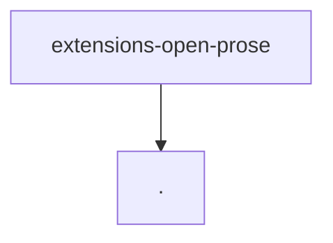

# Module: extensions/open-prose

[← Back to INDEX](../../INDEX.md)

**Type:** js/ts | **Files:** 2

**Entry point:** `extensions/open-prose/index.ts`

## Files

| File | Lines | Large |
| ---- | ----- | ----- |
| `extensions/open-prose/index.ts` | 11 |  |
| `extensions/open-prose/runtime-api.ts` | 3 |  |

---

## External Dependencies

Dependencies from other modules:

- `./runtime-api.js`
