# Imports

[← Back to MODULE](MODULE.md) | [← Back to INDEX](../../INDEX.md)

## Dependency Graph

```mermaid
graph TD
    extensions_opencode[extensions-opencode] --> _[.]
    extensions_opencode[extensions-opencode] --> _[.]
    extensions_opencode[extensions-opencode] --> _[.]
    extensions_opencode[extensions-opencode] --> _[.]
    extensions_opencode[extensions-opencode] --> _[.]
    extensions_opencode[extensions-opencode] --> _[.]
    extensions_opencode[extensions-opencode] --> _[.]
    extensions_opencode[extensions-opencode] --> _[.]
    extensions_opencode[extensions-opencode] --> _[.]
    extensions_opencode[extensions-opencode] --> _[.]
    extensions_opencode[extensions-opencode] --> _[.]
    extensions_opencode[extensions-opencode] --> node_child_process[node:child_process]
    extensions_opencode[extensions-opencode] --> node_events[node:events]
    extensions_opencode[extensions-opencode] --> node_fs[node:fs]
    extensions_opencode[extensions-opencode] --> node_fs[node:fs]
    extensions_opencode[extensions-opencode] --> node_os[node:os]
    extensions_opencode[extensions-opencode] --> node_path[node:path]
    extensions_opencode[extensions-opencode] --> node_process[node:process]
    extensions_opencode[extensions-opencode] --> plugin_sdk[plugin-sdk]
    extensions_opencode[extensions-opencode] --> plugin_sdk[plugin-sdk]
    extensions_opencode[extensions-opencode] --> plugin_sdk[plugin-sdk]
    extensions_opencode[extensions-opencode] --> plugin_sdk[plugin-sdk]
    extensions_opencode[extensions-opencode] --> plugin_sdk[plugin-sdk]
    extensions_opencode[extensions-opencode] --> plugin_sdk[plugin-sdk]
    extensions_opencode[extensions-opencode] --> plugin_sdk[plugin-sdk]
    extensions_opencode[extensions-opencode] --> plugin_sdk[plugin-sdk]
    extensions_opencode[extensions-opencode] --> plugin_sdk[plugin-sdk]
    extensions_opencode[extensions-opencode] --> plugin_sdk[plugin-sdk]
    extensions_opencode[extensions-opencode] --> plugin_sdk[plugin-sdk]
    extensions_opencode[extensions-opencode] --> plugin_sdk[plugin-sdk]
    extensions_opencode[extensions-opencode] --> plugin_sdk[plugin-sdk]
    extensions_opencode[extensions-opencode] --> plugin_sdk[plugin-sdk]
    extensions_opencode[extensions-opencode] --> plugin_sdk[plugin-sdk]
    extensions_opencode[extensions-opencode] --> typebox[typebox]
    extensions_opencode[extensions-opencode] --> vitest[vitest]
```

## External Dependencies

Dependencies from other modules:

- `./api.js`
- `./index.js`
- `./media-understanding-provider.js`
- `./onboard.js`
- `./openclaw.plugin.json`
- `./provider-catalog.js`
- `./provider-policy-api.js`
- `./session-catalog-plugin.js`
- `./session-catalog-shared.js`
- `./session-catalog-terminal.js`
- `./session-catalog.js`
- `node:child_process`
- `node:events`
- `node:fs`
- `node:fs/promises`
- `node:os`
- `node:path`
- `node:process`
- `openclaw/plugin-sdk/llm`
- `openclaw/plugin-sdk/media-understanding`
- `openclaw/plugin-sdk/node-host`
- `openclaw/plugin-sdk/plugin-entry`
- `openclaw/plugin-sdk/plugin-test-runtime`
- `openclaw/plugin-sdk/provider-auth-api-key`
- `openclaw/plugin-sdk/provider-auth-runtime`
- `openclaw/plugin-sdk/provider-catalog-live-runtime`
- `openclaw/plugin-sdk/provider-model-shared`
- `openclaw/plugin-sdk/provider-onboard`
- `openclaw/plugin-sdk/provider-test-contracts`
- `openclaw/plugin-sdk/string-coerce-runtime`
- `openclaw/plugin-sdk/test-live`
- `openclaw/plugin-sdk/text-utility-runtime`
- `openclaw/plugin-sdk/windows-spawn`
- `typebox`
- `vitest`
