# Imports

[← Back to MODULE](MODULE.md) | [← Back to INDEX](../../INDEX.md)

## Dependency Graph

```mermaid
graph TD
    extensions_openrouter[extensions-openrouter] --> _[.]
    extensions_openrouter[extensions-openrouter] --> _[.]
    extensions_openrouter[extensions-openrouter] --> _[.]
    extensions_openrouter[extensions-openrouter] --> _[.]
    extensions_openrouter[extensions-openrouter] --> _[.]
    extensions_openrouter[extensions-openrouter] --> _[.]
    extensions_openrouter[extensions-openrouter] --> _[.]
    extensions_openrouter[extensions-openrouter] --> _[.]
    extensions_openrouter[extensions-openrouter] --> _[.]
    extensions_openrouter[extensions-openrouter] --> _[.]
    extensions_openrouter[extensions-openrouter] --> _[.]
    extensions_openrouter[extensions-openrouter] --> _[.]
    extensions_openrouter[extensions-openrouter] --> _[.]
    extensions_openrouter[extensions-openrouter] --> _[.]
    extensions_openrouter[extensions-openrouter] --> _[.]
    extensions_openrouter[extensions-openrouter] --> _[.]
    extensions_openrouter[extensions-openrouter] --> _[.]
    extensions_openrouter[extensions-openrouter] --> node_fs[node:fs]
    extensions_openrouter[extensions-openrouter] --> node_http[node:http]
    extensions_openrouter[extensions-openrouter] --> node_path[node:path]
    extensions_openrouter[extensions-openrouter] --> openai[openai]
    extensions_openrouter[extensions-openrouter] --> plugin_sdk[plugin-sdk]
    extensions_openrouter[extensions-openrouter] --> plugin_sdk[plugin-sdk]
    extensions_openrouter[extensions-openrouter] --> plugin_sdk[plugin-sdk]
    extensions_openrouter[extensions-openrouter] --> plugin_sdk[plugin-sdk]
    extensions_openrouter[extensions-openrouter] --> plugin_sdk[plugin-sdk]
    extensions_openrouter[extensions-openrouter] --> plugin_sdk[plugin-sdk]
    extensions_openrouter[extensions-openrouter] --> plugin_sdk[plugin-sdk]
    extensions_openrouter[extensions-openrouter] --> plugin_sdk[plugin-sdk]
    extensions_openrouter[extensions-openrouter] --> plugin_sdk[plugin-sdk]
    extensions_openrouter[extensions-openrouter] --> plugin_sdk[plugin-sdk]
    extensions_openrouter[extensions-openrouter] --> plugin_sdk[plugin-sdk]
    extensions_openrouter[extensions-openrouter] --> plugin_sdk[plugin-sdk]
    extensions_openrouter[extensions-openrouter] --> plugin_sdk[plugin-sdk]
    extensions_openrouter[extensions-openrouter] --> plugin_sdk[plugin-sdk]
    extensions_openrouter[extensions-openrouter] --> plugin_sdk[plugin-sdk]
    extensions_openrouter[extensions-openrouter] --> plugin_sdk[plugin-sdk]
    extensions_openrouter[extensions-openrouter] --> plugin_sdk[plugin-sdk]
    extensions_openrouter[extensions-openrouter] --> plugin_sdk[plugin-sdk]
    extensions_openrouter[extensions-openrouter] --> plugin_sdk[plugin-sdk]
    extensions_openrouter[extensions-openrouter] --> plugin_sdk[plugin-sdk]
    extensions_openrouter[extensions-openrouter] --> plugin_sdk[plugin-sdk]
    extensions_openrouter[extensions-openrouter] --> plugin_sdk[plugin-sdk]
    extensions_openrouter[extensions-openrouter] --> plugin_sdk[plugin-sdk]
    extensions_openrouter[extensions-openrouter] --> plugin_sdk[plugin-sdk]
    extensions_openrouter[extensions-openrouter] --> plugin_sdk[plugin-sdk]
    extensions_openrouter[extensions-openrouter] --> plugin_sdk[plugin-sdk]
    extensions_openrouter[extensions-openrouter] --> vitest[vitest]
```

## External Dependencies

Dependencies from other modules:

- `./image-generation-provider.js`
- `./index.js`
- `./media-understanding-provider.js`
- `./models.js`
- `./music-generation-provider.js`
- `./oauth.js`
- `./onboard.js`
- `./provider-catalog.js`
- `./provider-policy-api.js`
- `./provider-routing.js`
- `./speech-provider.js`
- `./stream.js`
- `./thinking-policy.js`
- `./usage.js`
- `./video-generation-provider.js`
- `./video-http.js`
- `./video-model-catalog.js`
- `node:fs`
- `node:http`
- `node:path`
- `openai`
- `openclaw/plugin-sdk/agent-sessions`
- `openclaw/plugin-sdk/error-runtime`
- `openclaw/plugin-sdk/image-generation`
- `openclaw/plugin-sdk/llm`
- `openclaw/plugin-sdk/media-mime`
- `openclaw/plugin-sdk/media-runtime`
- `openclaw/plugin-sdk/media-understanding`
- `openclaw/plugin-sdk/number-runtime`
- `openclaw/plugin-sdk/plugin-entry`
- `openclaw/plugin-sdk/plugin-test-runtime`
- `openclaw/plugin-sdk/provider-auth`
- `openclaw/plugin-sdk/provider-auth-api-key`
- `openclaw/plugin-sdk/provider-auth-runtime`
- `openclaw/plugin-sdk/provider-catalog-shared`
- `openclaw/plugin-sdk/provider-http`
- `openclaw/plugin-sdk/provider-model-shared`
- `openclaw/plugin-sdk/provider-onboard`
- `openclaw/plugin-sdk/provider-stream-family`
- `openclaw/plugin-sdk/provider-stream-shared`
- `openclaw/plugin-sdk/provider-test-contracts`
- `openclaw/plugin-sdk/provider-usage`
- `openclaw/plugin-sdk/response-limit-runtime`
- `openclaw/plugin-sdk/runtime-env`
- `openclaw/plugin-sdk/speech`
- `openclaw/plugin-sdk/string-coerce-runtime`
- `openclaw/plugin-sdk/text-utility-runtime`
- `vitest`
