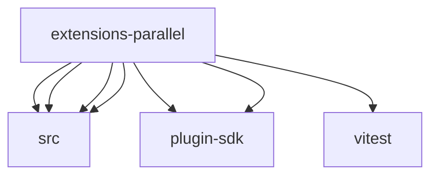

# Imports

[← Back to MODULE](MODULE.md) | [← Back to INDEX](../../INDEX.md)

## Dependency Graph

## External Dependencies

Dependencies from other modules:

- `./src/parallel-free-web-search-provider.js`
- `./src/parallel-free-web-search-provider.shared.js`
- `./src/parallel-web-search-provider.js`
- `./src/parallel-web-search-provider.shared.js`
- `openclaw/plugin-sdk/plugin-entry`
- `openclaw/plugin-sdk/test-live`
- `vitest`
