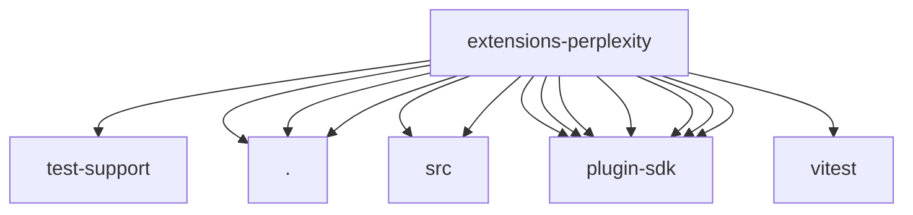

# Imports

[← Back to MODULE](MODULE.md) | [← Back to INDEX](../../INDEX.md)

## Dependency Graph

## External Dependencies

Dependencies from other modules:

- `../../test-support/streaming-error-response.js`
- `./perplexity-web-search-provider.js`
- `./perplexity-web-search-provider.runtime.js`
- `./perplexity-web-search-provider.shared.js`
- `./src/perplexity-web-search-provider.js`
- `./src/perplexity-web-search-provider.shared.js`
- `openclaw/plugin-sdk/lazy-runtime`
- `openclaw/plugin-sdk/plugin-entry`
- `openclaw/plugin-sdk/provider-http`
- `openclaw/plugin-sdk/provider-web-search`
- `openclaw/plugin-sdk/provider-web-search-config-contract`
- `openclaw/plugin-sdk/string-coerce-runtime`
- `openclaw/plugin-sdk/test-env`
- `vitest`
