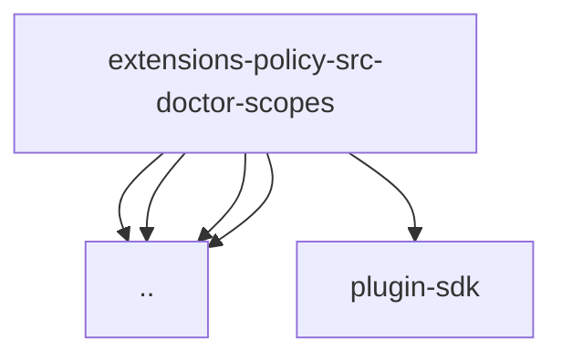

# Imports

[← Back to MODULE](MODULE.md) | [← Back to INDEX](../../INDEX.md)

## Dependency Graph

## External Dependencies

Dependencies from other modules:

- `../automatic-repairs.js`
- `../check-ids.js`
- `../review-required-repairs.js`
- `../utils.js`
- `openclaw/plugin-sdk/provider-model-shared`
