# Imports

[← Back to MODULE](MODULE.md) | [← Back to INDEX](../../INDEX.md)

## Dependency Graph

```mermaid
graph TD
    extensions_policy_src_doctor[extensions-policy-src-doctor] --> __[..]
    extensions_policy_src_doctor[extensions-policy-src-doctor] --> __[..]
    extensions_policy_src_doctor[extensions-policy-src-doctor] --> _[.]
    extensions_policy_src_doctor[extensions-policy-src-doctor] --> _[.]
    extensions_policy_src_doctor[extensions-policy-src-doctor] --> _[.]
    extensions_policy_src_doctor[extensions-policy-src-doctor] --> _[.]
    extensions_policy_src_doctor[extensions-policy-src-doctor] --> _[.]
    extensions_policy_src_doctor[extensions-policy-src-doctor] --> _[.]
    extensions_policy_src_doctor[extensions-policy-src-doctor] --> _[.]
    extensions_policy_src_doctor[extensions-policy-src-doctor] --> _[.]
    extensions_policy_src_doctor[extensions-policy-src-doctor] --> _[.]
    extensions_policy_src_doctor[extensions-policy-src-doctor] --> _[.]
    extensions_policy_src_doctor[extensions-policy-src-doctor] --> _[.]
    extensions_policy_src_doctor[extensions-policy-src-doctor] --> _[.]
    extensions_policy_src_doctor[extensions-policy-src-doctor] --> _[.]
    extensions_policy_src_doctor[extensions-policy-src-doctor] --> _[.]
    extensions_policy_src_doctor[extensions-policy-src-doctor] --> _[.]
    extensions_policy_src_doctor[extensions-policy-src-doctor] --> _[.]
    extensions_policy_src_doctor[extensions-policy-src-doctor] --> _[.]
    extensions_policy_src_doctor[extensions-policy-src-doctor] --> _[.]
    extensions_policy_src_doctor[extensions-policy-src-doctor] --> _[.]
    extensions_policy_src_doctor[extensions-policy-src-doctor] --> _[.]
    extensions_policy_src_doctor[extensions-policy-src-doctor] --> _[.]
    extensions_policy_src_doctor[extensions-policy-src-doctor] --> _[.]
    extensions_policy_src_doctor[extensions-policy-src-doctor] --> _[.]
    extensions_policy_src_doctor[extensions-policy-src-doctor] --> _[.]
    extensions_policy_src_doctor[extensions-policy-src-doctor] --> _[.]
    extensions_policy_src_doctor[extensions-policy-src-doctor] --> _[.]
    extensions_policy_src_doctor[extensions-policy-src-doctor] --> _[.]
    extensions_policy_src_doctor[extensions-policy-src-doctor] --> _[.]
    extensions_policy_src_doctor[extensions-policy-src-doctor] --> scopes[scopes]
    extensions_policy_src_doctor[extensions-policy-src-doctor] --> scopes[scopes]
    extensions_policy_src_doctor[extensions-policy-src-doctor] --> scopes[scopes]
    extensions_policy_src_doctor[extensions-policy-src-doctor] --> scopes[scopes]
    extensions_policy_src_doctor[extensions-policy-src-doctor] --> scopes[scopes]
    extensions_policy_src_doctor[extensions-policy-src-doctor] --> scopes[scopes]
    extensions_policy_src_doctor[extensions-policy-src-doctor] --> scopes[scopes]
    extensions_policy_src_doctor[extensions-policy-src-doctor] --> scopes[scopes]
    extensions_policy_src_doctor[extensions-policy-src-doctor] --> _[.]
    extensions_policy_src_doctor[extensions-policy-src-doctor] --> _[.]
    extensions_policy_src_doctor[extensions-policy-src-doctor] --> _[.]
    extensions_policy_src_doctor[extensions-policy-src-doctor] --> _[.]
    extensions_policy_src_doctor[extensions-policy-src-doctor] --> json5[json5]
    extensions_policy_src_doctor[extensions-policy-src-doctor] --> node_fs[node:fs]
    extensions_policy_src_doctor[extensions-policy-src-doctor] --> node_os[node:os]
    extensions_policy_src_doctor[extensions-policy-src-doctor] --> node_path[node:path]
    extensions_policy_src_doctor[extensions-policy-src-doctor] --> plugin_sdk[plugin-sdk]
    extensions_policy_src_doctor[extensions-policy-src-doctor] --> plugin_sdk[plugin-sdk]
    extensions_policy_src_doctor[extensions-policy-src-doctor] --> plugin_sdk[plugin-sdk]
    extensions_policy_src_doctor[extensions-policy-src-doctor] --> plugin_sdk[plugin-sdk]
    extensions_policy_src_doctor[extensions-policy-src-doctor] --> plugin_sdk[plugin-sdk]
    extensions_policy_src_doctor[extensions-policy-src-doctor] --> plugin_sdk[plugin-sdk]
    extensions_policy_src_doctor[extensions-policy-src-doctor] --> vitest[vitest]
```

## External Dependencies

Dependencies from other modules:

- `../policy-state.js`
- `../tool-policy-conformance.js`
- `./access-findings.js`
- `./access-shapes.js`
- `./agent-tool-shapes.js`
- `./agent-workspace-findings.js`
- `./check-ids.js`
- `./checks.js`
- `./data-auth-findings.js`
- `./data-auth-shapes.js`
- `./evaluation.js`
- `./exec-approval-findings.js`
- `./exec-approval-rules.js`
- `./fix-metadata.js`
- `./ingress-findings.js`
- `./metadata.js`
- `./policy-constants.js`
- `./policy-runtime.js`
- `./policy-scope.js`
- `./policy-shape.js`
- `./register.base.test-utils.js`
- `./register.gateway-data-and-approvals.test-utils.js`
- `./register.ingress-and-secrets.test-utils.js`
- `./register.js`
- `./register.models-and-mcp.test-utils.js`
- `./register.sandbox-and-tools.test-utils.js`
- `./register.test-harness.js`
- `./sandbox-findings.js`
- `./sandbox-gateway-shapes.js`
- `./scoped-policy-shape.js`
- `./scopes/channels.js`
- `./scopes/core.js`
- `./scopes/data-auth.js`
- `./scopes/exec-approvals.js`
- `./scopes/gateway.js`
- `./scopes/model-network.js`
- `./scopes/sandbox.js`
- `./scopes/tools.js`
- `./shape-helpers.js`
- `./strictness.js`
- `./tool-findings.js`
- `./utils.js`
- `json5`
- `node:fs`
- `node:os`
- `node:path`
- `openclaw/plugin-sdk/health`
- `openclaw/plugin-sdk/lazy-runtime`
- `openclaw/plugin-sdk/plugin-test-runtime`
- `openclaw/plugin-sdk/provider-model-shared`
- `openclaw/plugin-sdk/routing`
- `openclaw/plugin-sdk/string-coerce-runtime`
- `vitest`
