# Imports

[← Back to MODULE](MODULE.md) | [← Back to INDEX](../../INDEX.md)

## Dependency Graph

```mermaid
graph TD
    extensions_policy_src[extensions-policy-src] --> _[.]
    extensions_policy_src[extensions-policy-src] --> doctor[doctor]
    extensions_policy_src[extensions-policy-src] --> doctor[doctor]
    extensions_policy_src[extensions-policy-src] --> _[.]
    extensions_policy_src[extensions-policy-src] --> _[.]
    extensions_policy_src[extensions-policy-src] --> _[.]
    extensions_policy_src[extensions-policy-src] --> _[.]
    extensions_policy_src[extensions-policy-src] --> _[.]
    extensions_policy_src[extensions-policy-src] --> _[.]
    extensions_policy_src[extensions-policy-src] --> _[.]
    extensions_policy_src[extensions-policy-src] --> _[.]
    extensions_policy_src[extensions-policy-src] --> _[.]
    extensions_policy_src[extensions-policy-src] --> _[.]
    extensions_policy_src[extensions-policy-src] --> _[.]
    extensions_policy_src[extensions-policy-src] --> _[.]
    extensions_policy_src[extensions-policy-src] --> _[.]
    extensions_policy_src[extensions-policy-src] --> _[.]
    extensions_policy_src[extensions-policy-src] --> commander[commander]
    extensions_policy_src[extensions-policy-src] --> json5[json5]
    extensions_policy_src[extensions-policy-src] --> node_crypto[node:crypto]
    extensions_policy_src[extensions-policy-src] --> node_fs[node:fs]
    extensions_policy_src[extensions-policy-src] --> node_os[node:os]
    extensions_policy_src[extensions-policy-src] --> node_path[node:path]
    extensions_policy_src[extensions-policy-src] --> node_timers[node:timers]
    extensions_policy_src[extensions-policy-src] --> plugin_sdk[plugin-sdk]
    extensions_policy_src[extensions-policy-src] --> plugin_sdk[plugin-sdk]
    extensions_policy_src[extensions-policy-src] --> plugin_sdk[plugin-sdk]
    extensions_policy_src[extensions-policy-src] --> plugin_sdk[plugin-sdk]
    extensions_policy_src[extensions-policy-src] --> plugin_sdk[plugin-sdk]
    extensions_policy_src[extensions-policy-src] --> plugin_sdk[plugin-sdk]
    extensions_policy_src[extensions-policy-src] --> vitest[vitest]
```

## External Dependencies

Dependencies from other modules:

- `./cli.js`
- `./doctor/fix-metadata.js`
- `./doctor/register.js`
- `./policy-conformance.js`
- `./policy-state-core.js`
- `./policy-state-data.js`
- `./policy-state-exec-approvals.js`
- `./policy-state-gateway.js`
- `./policy-state-helpers.js`
- `./policy-state-ingress.js`
- `./policy-state-sandbox.js`
- `./policy-state-tool-posture.js`
- `./policy-state-tools.js`
- `./policy-state-types.js`
- `./policy-state-workspace.js`
- `./policy-state.js`
- `./tool-policy-conformance.js`
- `commander`
- `json5`
- `node:crypto`
- `node:fs`
- `node:os`
- `node:path`
- `node:timers/promises`
- `openclaw/plugin-sdk/health`
- `openclaw/plugin-sdk/provider-model-shared`
- `openclaw/plugin-sdk/routing`
- `openclaw/plugin-sdk/runtime-config-snapshot`
- `openclaw/plugin-sdk/secret-input`
- `openclaw/plugin-sdk/string-coerce-runtime`
- `vitest`
