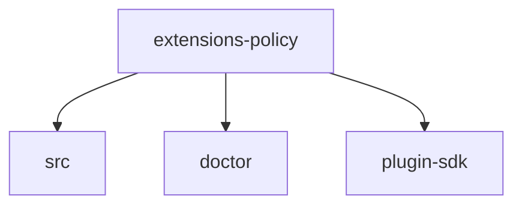

# Module: extensions/policy

[← Back to INDEX](../../INDEX.md)

**Type:** js/ts | **Files:** 2

**Entry point:** `extensions/policy/index.ts`

## Files

| File | Lines | Large |
| ---- | ----- | ----- |
| `extensions/policy/api.ts` | 2 |  |
| `extensions/policy/index.ts` | 27 |  |

## Child Modules

- [extensions-policy-src](../extensions-policy-src/MODULE.md)

---

| High 🔴 | Medium 🟡 | Low 🟢 |
| 2 | 0 | 0 |

## 🔴 High Priority

### `RULE` (extensions/policy/api.ts:1)

> API module exposes the plugin public contract.

### `RULE` (extensions/policy/index.ts:1)

> plugin entrypoint registers its OpenClaw integration.
---

## External Dependencies

Dependencies from other modules:

- `./src/cli.js`
- `./src/doctor/register.js`
- `openclaw/plugin-sdk/plugin-entry`
