# Imports

[← Back to MODULE](MODULE.md) | [← Back to INDEX](../../INDEX.md)

## Dependency Graph

```mermaid
graph TD
    extensions_qa_channel_src[extensions-qa-channel-src] --> qa_lab[qa-lab]
    extensions_qa_channel_src[extensions-qa-channel-src] --> __[..]
    extensions_qa_channel_src[extensions-qa-channel-src] --> _[.]
    extensions_qa_channel_src[extensions-qa-channel-src] --> _[.]
    extensions_qa_channel_src[extensions-qa-channel-src] --> _[.]
    extensions_qa_channel_src[extensions-qa-channel-src] --> _[.]
    extensions_qa_channel_src[extensions-qa-channel-src] --> _[.]
    extensions_qa_channel_src[extensions-qa-channel-src] --> _[.]
    extensions_qa_channel_src[extensions-qa-channel-src] --> _[.]
    extensions_qa_channel_src[extensions-qa-channel-src] --> _[.]
    extensions_qa_channel_src[extensions-qa-channel-src] --> _[.]
    extensions_qa_channel_src[extensions-qa-channel-src] --> _[.]
    extensions_qa_channel_src[extensions-qa-channel-src] --> _[.]
    extensions_qa_channel_src[extensions-qa-channel-src] --> _[.]
    extensions_qa_channel_src[extensions-qa-channel-src] --> node_http[node:http]
    extensions_qa_channel_src[extensions-qa-channel-src] --> node_https[node:https]
    extensions_qa_channel_src[extensions-qa-channel-src] --> node_path[node:path]
    extensions_qa_channel_src[extensions-qa-channel-src] --> plugin_sdk[plugin-sdk]
    extensions_qa_channel_src[extensions-qa-channel-src] --> plugin_sdk[plugin-sdk]
    extensions_qa_channel_src[extensions-qa-channel-src] --> plugin_sdk[plugin-sdk]
    extensions_qa_channel_src[extensions-qa-channel-src] --> plugin_sdk[plugin-sdk]
    extensions_qa_channel_src[extensions-qa-channel-src] --> plugin_sdk[plugin-sdk]
    extensions_qa_channel_src[extensions-qa-channel-src] --> plugin_sdk[plugin-sdk]
    extensions_qa_channel_src[extensions-qa-channel-src] --> plugin_sdk[plugin-sdk]
    extensions_qa_channel_src[extensions-qa-channel-src] --> plugin_sdk[plugin-sdk]
    extensions_qa_channel_src[extensions-qa-channel-src] --> plugin_sdk[plugin-sdk]
    extensions_qa_channel_src[extensions-qa-channel-src] --> plugin_sdk[plugin-sdk]
    extensions_qa_channel_src[extensions-qa-channel-src] --> plugin_sdk[plugin-sdk]
    extensions_qa_channel_src[extensions-qa-channel-src] --> plugin_sdk[plugin-sdk]
    extensions_qa_channel_src[extensions-qa-channel-src] --> plugin_sdk[plugin-sdk]
    extensions_qa_channel_src[extensions-qa-channel-src] --> plugin_sdk[plugin-sdk]
    extensions_qa_channel_src[extensions-qa-channel-src] --> plugin_sdk[plugin-sdk]
    extensions_qa_channel_src[extensions-qa-channel-src] --> plugin_sdk[plugin-sdk]
    extensions_qa_channel_src[extensions-qa-channel-src] --> plugin_sdk[plugin-sdk]
    extensions_qa_channel_src[extensions-qa-channel-src] --> plugin_sdk[plugin-sdk]
    extensions_qa_channel_src[extensions-qa-channel-src] --> plugin_sdk[plugin-sdk]
    extensions_qa_channel_src[extensions-qa-channel-src] --> plugin_sdk[plugin-sdk]
    extensions_qa_channel_src[extensions-qa-channel-src] --> plugin_sdk[plugin-sdk]
    extensions_qa_channel_src[extensions-qa-channel-src] --> plugin_sdk[plugin-sdk]
    extensions_qa_channel_src[extensions-qa-channel-src] --> plugin_sdk[plugin-sdk]
    extensions_qa_channel_src[extensions-qa-channel-src] --> typebox[typebox]
    extensions_qa_channel_src[extensions-qa-channel-src] --> vitest[vitest]
    extensions_qa_channel_src[extensions-qa-channel-src] --> zod[zod]
```

## External Dependencies

Dependencies from other modules:

- `../../qa-lab/bus-api.js`
- `../api.js`
- `./accounts.js`
- `./bus-client.js`
- `./channel-actions.js`
- `./channel-base.js`
- `./config-schema.js`
- `./gateway.js`
- `./inbound.js`
- `./outbound.js`
- `./runtime-api.js`
- `./runtime.js`
- `./setup.js`
- `./status.js`
- `node:http`
- `node:https`
- `node:path`
- `openclaw/plugin-sdk/account-helpers`
- `openclaw/plugin-sdk/account-id`
- `openclaw/plugin-sdk/account-resolution-runtime`
- `openclaw/plugin-sdk/channel-actions`
- `openclaw/plugin-sdk/channel-config-schema`
- `openclaw/plugin-sdk/channel-core`
- `openclaw/plugin-sdk/channel-inbound`
- `openclaw/plugin-sdk/channel-ingress-runtime`
- `openclaw/plugin-sdk/channel-outbound`
- `openclaw/plugin-sdk/channel-test-helpers`
- `openclaw/plugin-sdk/command-auth-native`
- `openclaw/plugin-sdk/error-runtime`
- `openclaw/plugin-sdk/media-runtime`
- `openclaw/plugin-sdk/number-runtime`
- `openclaw/plugin-sdk/plugin-test-runtime`
- `openclaw/plugin-sdk/provider-http`
- `openclaw/plugin-sdk/qa-channel-protocol`
- `openclaw/plugin-sdk/response-limit-runtime`
- `openclaw/plugin-sdk/runtime-store`
- `openclaw/plugin-sdk/ssrf-runtime`
- `openclaw/plugin-sdk/string-coerce-runtime`
- `openclaw/plugin-sdk/tool-payload`
- `openclaw/plugin-sdk/tool-send`
- `typebox`
- `vitest`
- `zod`
