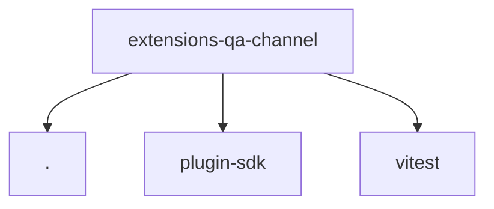

# Module: extensions/qa-channel

[← Back to INDEX](../../INDEX.md)

**Type:** js/ts | **Files:** 8

**Entry point:** `extensions/qa-channel/index.ts`

## Files

| File | Lines | Large |
| ---- | ----- | ----- |
| `extensions/qa-channel/api.ts` | 46 |  |
| `extensions/qa-channel/channel-plugin-api.ts` | 2 |  |
| `extensions/qa-channel/index.ts` | 17 |  |
| `extensions/qa-channel/runtime-api.ts` | 21 |  |
| `extensions/qa-channel/setup-entry.test.ts` | 18 |  |
| `extensions/qa-channel/setup-entry.ts` | 14 |  |
| `extensions/qa-channel/setup-plugin-api.ts` | 3 |  |
| `extensions/qa-channel/test-api.ts` | 3 |  |

## Child Modules

- [extensions-qa-channel-src](../extensions-qa-channel-src/MODULE.md)

---

## External Dependencies

Dependencies from other modules:

- `./setup-entry.js`
- `openclaw/plugin-sdk/channel-entry-contract`
- `vitest`
