# Imports

[← Back to MODULE](MODULE.md) | [← Back to INDEX](../../INDEX.md)

## Dependency Graph

```mermaid
graph TD
    extensions_qa_lab_src_live_transports_discord[extensions-qa-lab-src-live-transports-discord] --> __[..]
    extensions_qa_lab_src_live_transports_discord[extensions-qa-lab-src-live-transports-discord] --> __[..]
    extensions_qa_lab_src_live_transports_discord[extensions-qa-lab-src-live-transports-discord] --> __[..]
    extensions_qa_lab_src_live_transports_discord[extensions-qa-lab-src-live-transports-discord] --> shared[shared]
    extensions_qa_lab_src_live_transports_discord[extensions-qa-lab-src-live-transports-discord] --> shared[shared]
    extensions_qa_lab_src_live_transports_discord[extensions-qa-lab-src-live-transports-discord] --> shared[shared]
    extensions_qa_lab_src_live_transports_discord[extensions-qa-lab-src-live-transports-discord] --> shared[shared]
    extensions_qa_lab_src_live_transports_discord[extensions-qa-lab-src-live-transports-discord] --> _[.]
    extensions_qa_lab_src_live_transports_discord[extensions-qa-lab-src-live-transports-discord] --> _[.]
    extensions_qa_lab_src_live_transports_discord[extensions-qa-lab-src-live-transports-discord] --> _[.]
    extensions_qa_lab_src_live_transports_discord[extensions-qa-lab-src-live-transports-discord] --> discord[discord]
    extensions_qa_lab_src_live_transports_discord[extensions-qa-lab-src-live-transports-discord] --> node_crypto[node:crypto]
    extensions_qa_lab_src_live_transports_discord[extensions-qa-lab-src-live-transports-discord] --> node_fs[node:fs]
    extensions_qa_lab_src_live_transports_discord[extensions-qa-lab-src-live-transports-discord] --> node_path[node:path]
    extensions_qa_lab_src_live_transports_discord[extensions-qa-lab-src-live-transports-discord] --> node_url[node:url]
    extensions_qa_lab_src_live_transports_discord[extensions-qa-lab-src-live-transports-discord] --> plugin_sdk[plugin-sdk]
    extensions_qa_lab_src_live_transports_discord[extensions-qa-lab-src-live-transports-discord] --> plugin_sdk[plugin-sdk]
    extensions_qa_lab_src_live_transports_discord[extensions-qa-lab-src-live-transports-discord] --> plugin_sdk[plugin-sdk]
    extensions_qa_lab_src_live_transports_discord[extensions-qa-lab-src-live-transports-discord] --> plugin_sdk[plugin-sdk]
    extensions_qa_lab_src_live_transports_discord[extensions-qa-lab-src-live-transports-discord] --> plugin_sdk[plugin-sdk]
    extensions_qa_lab_src_live_transports_discord[extensions-qa-lab-src-live-transports-discord] --> playwright_core[playwright-core]
    extensions_qa_lab_src_live_transports_discord[extensions-qa-lab-src-live-transports-discord] --> vitest[vitest]
    extensions_qa_lab_src_live_transports_discord[extensions-qa-lab-src-live-transports-discord] --> zod[zod]
```

## External Dependencies

Dependencies from other modules:

- `../../gateway-child.js`
- `../../mantis-options.runtime.js`
- `../../scenario-catalog.js`
- `../shared/credential-lease.runtime.js`
- `../shared/live-gateway-config.runtime.js`
- `../shared/live-scenario-reply.js`
- `../shared/live-transport-cli.js`
- `./discord-live.runtime.js`
- `./scenario-environment.js`
- `./scenario-selection.js`
- `@openclaw/discord/api.js`
- `node:crypto`
- `node:fs/promises`
- `node:path`
- `node:url`
- `openclaw/plugin-sdk/channel-feedback`
- `openclaw/plugin-sdk/error-runtime`
- `openclaw/plugin-sdk/security-runtime`
- `openclaw/plugin-sdk/string-coerce-runtime`
- `openclaw/plugin-sdk/text-utility-runtime`
- `playwright-core`
- `vitest`
- `zod`
