# Imports

[← Back to MODULE](MODULE.md) | [← Back to INDEX](../../INDEX.md)

## Dependency Graph

```mermaid
graph TD
    extensions_qa_lab_src_live_transports_matrix_scenarios[extensions-qa-lab-src-live-transports-matrix-scenarios] --> __[..]
    extensions_qa_lab_src_live_transports_matrix_scenarios[extensions-qa-lab-src-live-transports-matrix-scenarios] --> substrate[substrate]
    extensions_qa_lab_src_live_transports_matrix_scenarios[extensions-qa-lab-src-live-transports-matrix-scenarios] --> substrate[substrate]
    extensions_qa_lab_src_live_transports_matrix_scenarios[extensions-qa-lab-src-live-transports-matrix-scenarios] --> substrate[substrate]
    extensions_qa_lab_src_live_transports_matrix_scenarios[extensions-qa-lab-src-live-transports-matrix-scenarios] --> substrate[substrate]
    extensions_qa_lab_src_live_transports_matrix_scenarios[extensions-qa-lab-src-live-transports-matrix-scenarios] --> substrate[substrate]
    extensions_qa_lab_src_live_transports_matrix_scenarios[extensions-qa-lab-src-live-transports-matrix-scenarios] --> substrate[substrate]
    extensions_qa_lab_src_live_transports_matrix_scenarios[extensions-qa-lab-src-live-transports-matrix-scenarios] --> substrate[substrate]
    extensions_qa_lab_src_live_transports_matrix_scenarios[extensions-qa-lab-src-live-transports-matrix-scenarios] --> _[.]
    extensions_qa_lab_src_live_transports_matrix_scenarios[extensions-qa-lab-src-live-transports-matrix-scenarios] --> _[.]
    extensions_qa_lab_src_live_transports_matrix_scenarios[extensions-qa-lab-src-live-transports-matrix-scenarios] --> _[.]
    extensions_qa_lab_src_live_transports_matrix_scenarios[extensions-qa-lab-src-live-transports-matrix-scenarios] --> _[.]
    extensions_qa_lab_src_live_transports_matrix_scenarios[extensions-qa-lab-src-live-transports-matrix-scenarios] --> _[.]
    extensions_qa_lab_src_live_transports_matrix_scenarios[extensions-qa-lab-src-live-transports-matrix-scenarios] --> _[.]
    extensions_qa_lab_src_live_transports_matrix_scenarios[extensions-qa-lab-src-live-transports-matrix-scenarios] --> _[.]
    extensions_qa_lab_src_live_transports_matrix_scenarios[extensions-qa-lab-src-live-transports-matrix-scenarios] --> _[.]
    extensions_qa_lab_src_live_transports_matrix_scenarios[extensions-qa-lab-src-live-transports-matrix-scenarios] --> _[.]
    extensions_qa_lab_src_live_transports_matrix_scenarios[extensions-qa-lab-src-live-transports-matrix-scenarios] --> _[.]
    extensions_qa_lab_src_live_transports_matrix_scenarios[extensions-qa-lab-src-live-transports-matrix-scenarios] --> _[.]
    extensions_qa_lab_src_live_transports_matrix_scenarios[extensions-qa-lab-src-live-transports-matrix-scenarios] --> _[.]
    extensions_qa_lab_src_live_transports_matrix_scenarios[extensions-qa-lab-src-live-transports-matrix-scenarios] --> _[.]
    extensions_qa_lab_src_live_transports_matrix_scenarios[extensions-qa-lab-src-live-transports-matrix-scenarios] --> _[.]
    extensions_qa_lab_src_live_transports_matrix_scenarios[extensions-qa-lab-src-live-transports-matrix-scenarios] --> _[.]
    extensions_qa_lab_src_live_transports_matrix_scenarios[extensions-qa-lab-src-live-transports-matrix-scenarios] --> _[.]
    extensions_qa_lab_src_live_transports_matrix_scenarios[extensions-qa-lab-src-live-transports-matrix-scenarios] --> _[.]
    extensions_qa_lab_src_live_transports_matrix_scenarios[extensions-qa-lab-src-live-transports-matrix-scenarios] --> _[.]
    extensions_qa_lab_src_live_transports_matrix_scenarios[extensions-qa-lab-src-live-transports-matrix-scenarios] --> _[.]
    extensions_qa_lab_src_live_transports_matrix_scenarios[extensions-qa-lab-src-live-transports-matrix-scenarios] --> _[.]
    extensions_qa_lab_src_live_transports_matrix_scenarios[extensions-qa-lab-src-live-transports-matrix-scenarios] --> _[.]
    extensions_qa_lab_src_live_transports_matrix_scenarios[extensions-qa-lab-src-live-transports-matrix-scenarios] --> node_child_process[node:child_process]
    extensions_qa_lab_src_live_transports_matrix_scenarios[extensions-qa-lab-src-live-transports-matrix-scenarios] --> node_crypto[node:crypto]
    extensions_qa_lab_src_live_transports_matrix_scenarios[extensions-qa-lab-src-live-transports-matrix-scenarios] --> node_fs[node:fs]
    extensions_qa_lab_src_live_transports_matrix_scenarios[extensions-qa-lab-src-live-transports-matrix-scenarios] --> node_fs[node:fs]
    extensions_qa_lab_src_live_transports_matrix_scenarios[extensions-qa-lab-src-live-transports-matrix-scenarios] --> node_os[node:os]
    extensions_qa_lab_src_live_transports_matrix_scenarios[extensions-qa-lab-src-live-transports-matrix-scenarios] --> node_path[node:path]
    extensions_qa_lab_src_live_transports_matrix_scenarios[extensions-qa-lab-src-live-transports-matrix-scenarios] --> node_timers[node:timers]
    extensions_qa_lab_src_live_transports_matrix_scenarios[extensions-qa-lab-src-live-transports-matrix-scenarios] --> node_util[node:util]
    extensions_qa_lab_src_live_transports_matrix_scenarios[extensions-qa-lab-src-live-transports-matrix-scenarios] --> plugin_sdk[plugin-sdk]
    extensions_qa_lab_src_live_transports_matrix_scenarios[extensions-qa-lab-src-live-transports-matrix-scenarios] --> plugin_sdk[plugin-sdk]
    extensions_qa_lab_src_live_transports_matrix_scenarios[extensions-qa-lab-src-live-transports-matrix-scenarios] --> plugin_sdk[plugin-sdk]
    extensions_qa_lab_src_live_transports_matrix_scenarios[extensions-qa-lab-src-live-transports-matrix-scenarios] --> plugin_sdk[plugin-sdk]
    extensions_qa_lab_src_live_transports_matrix_scenarios[extensions-qa-lab-src-live-transports-matrix-scenarios] --> plugin_sdk[plugin-sdk]
    extensions_qa_lab_src_live_transports_matrix_scenarios[extensions-qa-lab-src-live-transports-matrix-scenarios] --> plugin_sdk[plugin-sdk]
    extensions_qa_lab_src_live_transports_matrix_scenarios[extensions-qa-lab-src-live-transports-matrix-scenarios] --> plugin_sdk[plugin-sdk]
    extensions_qa_lab_src_live_transports_matrix_scenarios[extensions-qa-lab-src-live-transports-matrix-scenarios] --> plugin_sdk[plugin-sdk]
    extensions_qa_lab_src_live_transports_matrix_scenarios[extensions-qa-lab-src-live-transports-matrix-scenarios] --> vitest[vitest]
```

## External Dependencies

Dependencies from other modules:

- `../../../windows-system-tools.js`
- `../substrate/client.js`
- `../substrate/config.js`
- `../substrate/e2ee-client.js`
- `../substrate/fault-proxy.js`
- `../substrate/request.js`
- `../substrate/sync.js`
- `../substrate/topology.js`
- `./scenario-contract.js`
- `./scenario-environment.js`
- `./scenario-media-fixtures.js`
- `./scenario-runtime-cli-process.js`
- `./scenario-runtime-cli.js`
- `./scenario-runtime-config.js`
- `./scenario-runtime-e2ee-cli-config.js`
- `./scenario-runtime-e2ee-cli-runtime.js`
- `./scenario-runtime-e2ee-cli-shared.js`
- `./scenario-runtime-e2ee-destructive-recovery.js`
- `./scenario-runtime-e2ee-room.js`
- `./scenario-runtime-e2ee-shared.js`
- `./scenario-runtime-e2ee-state.js`
- `./scenario-runtime-media.js`
- `./scenario-runtime-prompts.js`
- `./scenario-runtime-reaction.js`
- `./scenario-runtime-room.js`
- `./scenario-runtime-shared.js`
- `./scenario-runtime-state-files.js`
- `./scenario-runtime-thread.js`
- `./scenario-runtime-tool-progress-diagnostics.js`
- `node:child_process`
- `node:crypto`
- `node:fs`
- `node:fs/promises`
- `node:os`
- `node:path`
- `node:timers/promises`
- `node:util`
- `openclaw/plugin-sdk/error-runtime`
- `openclaw/plugin-sdk/logging-core`
- `openclaw/plugin-sdk/persistent-dedupe`
- `openclaw/plugin-sdk/plugin-state-test-runtime`
- `openclaw/plugin-sdk/security-runtime`
- `openclaw/plugin-sdk/string-coerce-runtime`
- `openclaw/plugin-sdk/temp-path`
- `openclaw/plugin-sdk/text-utility-runtime`
- `vitest`
