# Imports

[← Back to MODULE](MODULE.md) | [← Back to INDEX](../../INDEX.md)

## Dependency Graph

```mermaid
graph TD
    extensions_qa_lab_src_live_transports_matrix_substrate[extensions-qa-lab-src-live-transports-matrix-substrate] --> __[..]
    extensions_qa_lab_src_live_transports_matrix_substrate[extensions-qa-lab-src-live-transports-matrix-substrate] --> _[.]
    extensions_qa_lab_src_live_transports_matrix_substrate[extensions-qa-lab-src-live-transports-matrix-substrate] --> _[.]
    extensions_qa_lab_src_live_transports_matrix_substrate[extensions-qa-lab-src-live-transports-matrix-substrate] --> _[.]
    extensions_qa_lab_src_live_transports_matrix_substrate[extensions-qa-lab-src-live-transports-matrix-substrate] --> _[.]
    extensions_qa_lab_src_live_transports_matrix_substrate[extensions-qa-lab-src-live-transports-matrix-substrate] --> _[.]
    extensions_qa_lab_src_live_transports_matrix_substrate[extensions-qa-lab-src-live-transports-matrix-substrate] --> _[.]
    extensions_qa_lab_src_live_transports_matrix_substrate[extensions-qa-lab-src-live-transports-matrix-substrate] --> _[.]
    extensions_qa_lab_src_live_transports_matrix_substrate[extensions-qa-lab-src-live-transports-matrix-substrate] --> _[.]
    extensions_qa_lab_src_live_transports_matrix_substrate[extensions-qa-lab-src-live-transports-matrix-substrate] --> _[.]
    extensions_qa_lab_src_live_transports_matrix_substrate[extensions-qa-lab-src-live-transports-matrix-substrate] --> _[.]
    extensions_qa_lab_src_live_transports_matrix_substrate[extensions-qa-lab-src-live-transports-matrix-substrate] --> _[.]
    extensions_qa_lab_src_live_transports_matrix_substrate[extensions-qa-lab-src-live-transports-matrix-substrate] --> _[.]
    extensions_qa_lab_src_live_transports_matrix_substrate[extensions-qa-lab-src-live-transports-matrix-substrate] --> _[.]
    extensions_qa_lab_src_live_transports_matrix_substrate[extensions-qa-lab-src-live-transports-matrix-substrate] --> node_crypto[node:crypto]
    extensions_qa_lab_src_live_transports_matrix_substrate[extensions-qa-lab-src-live-transports-matrix-substrate] --> node_fs[node:fs]
    extensions_qa_lab_src_live_transports_matrix_substrate[extensions-qa-lab-src-live-transports-matrix-substrate] --> node_http[node:http]
    extensions_qa_lab_src_live_transports_matrix_substrate[extensions-qa-lab-src-live-transports-matrix-substrate] --> node_os[node:os]
    extensions_qa_lab_src_live_transports_matrix_substrate[extensions-qa-lab-src-live-transports-matrix-substrate] --> node_path[node:path]
    extensions_qa_lab_src_live_transports_matrix_substrate[extensions-qa-lab-src-live-transports-matrix-substrate] --> node_timers[node:timers]
    extensions_qa_lab_src_live_transports_matrix_substrate[extensions-qa-lab-src-live-transports-matrix-substrate] --> node_zlib[node:zlib]
    extensions_qa_lab_src_live_transports_matrix_substrate[extensions-qa-lab-src-live-transports-matrix-substrate] --> plugin_sdk[plugin-sdk]
    extensions_qa_lab_src_live_transports_matrix_substrate[extensions-qa-lab-src-live-transports-matrix-substrate] --> plugin_sdk[plugin-sdk]
    extensions_qa_lab_src_live_transports_matrix_substrate[extensions-qa-lab-src-live-transports-matrix-substrate] --> plugin_sdk[plugin-sdk]
    extensions_qa_lab_src_live_transports_matrix_substrate[extensions-qa-lab-src-live-transports-matrix-substrate] --> plugin_sdk[plugin-sdk]
    extensions_qa_lab_src_live_transports_matrix_substrate[extensions-qa-lab-src-live-transports-matrix-substrate] --> plugin_sdk[plugin-sdk]
    extensions_qa_lab_src_live_transports_matrix_substrate[extensions-qa-lab-src-live-transports-matrix-substrate] --> plugin_sdk[plugin-sdk]
    extensions_qa_lab_src_live_transports_matrix_substrate[extensions-qa-lab-src-live-transports-matrix-substrate] --> plugin_sdk[plugin-sdk]
    extensions_qa_lab_src_live_transports_matrix_substrate[extensions-qa-lab-src-live-transports-matrix-substrate] --> vitest[vitest]
```

## External Dependencies

Dependencies from other modules:

- `../../../docker-runtime.js`
- `./client-message-content.js`
- `./client.js`
- `./config.js`
- `./e2ee-client-internals.js`
- `./events.js`
- `./fault-proxy.js`
- `./harness.runtime-internals.js`
- `./harness.runtime.js`
- `./recording-proxy-internals.js`
- `./recording-proxy.js`
- `./request.js`
- `./sync.js`
- `./topology.js`
- `node:crypto`
- `node:fs/promises`
- `node:http`
- `node:os`
- `node:path`
- `node:timers/promises`
- `node:zlib`
- `openclaw/plugin-sdk/error-runtime`
- `openclaw/plugin-sdk/expect-runtime`
- `openclaw/plugin-sdk/number-runtime`
- `openclaw/plugin-sdk/response-limit-runtime`
- `openclaw/plugin-sdk/ssrf-runtime`
- `openclaw/plugin-sdk/string-coerce-runtime`
- `openclaw/plugin-sdk/test-env`
- `vitest`
