# Imports

[← Back to MODULE](MODULE.md) | [← Back to INDEX](../../INDEX.md)

## Dependency Graph

```mermaid
graph TD
    extensions_qa_lab_src_live_transports_shared[extensions-qa-lab-src-live-transports-shared] --> __[..]
    extensions_qa_lab_src_live_transports_shared[extensions-qa-lab-src-live-transports-shared] --> __[..]
    extensions_qa_lab_src_live_transports_shared[extensions-qa-lab-src-live-transports-shared] --> providers[providers]
    extensions_qa_lab_src_live_transports_shared[extensions-qa-lab-src-live-transports-shared] --> providers[providers]
    extensions_qa_lab_src_live_transports_shared[extensions-qa-lab-src-live-transports-shared] --> __[..]
    extensions_qa_lab_src_live_transports_shared[extensions-qa-lab-src-live-transports-shared] --> __[..]
    extensions_qa_lab_src_live_transports_shared[extensions-qa-lab-src-live-transports-shared] --> _[.]
    extensions_qa_lab_src_live_transports_shared[extensions-qa-lab-src-live-transports-shared] --> _[.]
    extensions_qa_lab_src_live_transports_shared[extensions-qa-lab-src-live-transports-shared] --> _[.]
    extensions_qa_lab_src_live_transports_shared[extensions-qa-lab-src-live-transports-shared] --> _[.]
    extensions_qa_lab_src_live_transports_shared[extensions-qa-lab-src-live-transports-shared] --> _[.]
    extensions_qa_lab_src_live_transports_shared[extensions-qa-lab-src-live-transports-shared] --> node_crypto[node:crypto]
    extensions_qa_lab_src_live_transports_shared[extensions-qa-lab-src-live-transports-shared] --> node_http[node:http]
    extensions_qa_lab_src_live_transports_shared[extensions-qa-lab-src-live-transports-shared] --> node_timers[node:timers]
    extensions_qa_lab_src_live_transports_shared[extensions-qa-lab-src-live-transports-shared] --> plugin_sdk[plugin-sdk]
    extensions_qa_lab_src_live_transports_shared[extensions-qa-lab-src-live-transports-shared] --> plugin_sdk[plugin-sdk]
    extensions_qa_lab_src_live_transports_shared[extensions-qa-lab-src-live-transports-shared] --> plugin_sdk[plugin-sdk]
    extensions_qa_lab_src_live_transports_shared[extensions-qa-lab-src-live-transports-shared] --> plugin_sdk[plugin-sdk]
    extensions_qa_lab_src_live_transports_shared[extensions-qa-lab-src-live-transports-shared] --> vitest[vitest]
    extensions_qa_lab_src_live_transports_shared[extensions-qa-lab-src-live-transports-shared] --> zod[zod]
```

## External Dependencies

Dependencies from other modules:

- `../../cli.runtime.js`
- `../../gateway-child.js`
- `../../providers/index.js`
- `../../providers/server-runtime.js`
- `../../qa-credentials-common.runtime.js`
- `../../run-config.js`
- `./credential-lease.runtime.js`
- `./live-artifacts.js`
- `./live-gateway-config.runtime.js`
- `./live-gateway.runtime.js`
- `./live-transport-suite.runtime.js`
- `node:crypto`
- `node:http`
- `node:timers/promises`
- `openclaw/plugin-sdk/error-runtime`
- `openclaw/plugin-sdk/expect-runtime`
- `openclaw/plugin-sdk/number-runtime`
- `openclaw/plugin-sdk/provider-http`
- `vitest`
- `zod`
