# Imports

[← Back to MODULE](MODULE.md) | [← Back to INDEX](../../INDEX.md)

## Dependency Graph

```mermaid
graph TD
    extensions_qa_lab_src_live_transports_slack[extensions-qa-lab-src-live-transports-slack] --> __[..]
    extensions_qa_lab_src_live_transports_slack[extensions-qa-lab-src-live-transports-slack] --> __[..]
    extensions_qa_lab_src_live_transports_slack[extensions-qa-lab-src-live-transports-slack] --> __[..]
    extensions_qa_lab_src_live_transports_slack[extensions-qa-lab-src-live-transports-slack] --> __[..]
    extensions_qa_lab_src_live_transports_slack[extensions-qa-lab-src-live-transports-slack] --> shared[shared]
    extensions_qa_lab_src_live_transports_slack[extensions-qa-lab-src-live-transports-slack] --> shared[shared]
    extensions_qa_lab_src_live_transports_slack[extensions-qa-lab-src-live-transports-slack] --> shared[shared]
    extensions_qa_lab_src_live_transports_slack[extensions-qa-lab-src-live-transports-slack] --> shared[shared]
    extensions_qa_lab_src_live_transports_slack[extensions-qa-lab-src-live-transports-slack] --> _[.]
    extensions_qa_lab_src_live_transports_slack[extensions-qa-lab-src-live-transports-slack] --> _[.]
    extensions_qa_lab_src_live_transports_slack[extensions-qa-lab-src-live-transports-slack] --> _[.]
    extensions_qa_lab_src_live_transports_slack[extensions-qa-lab-src-live-transports-slack] --> _[.]
    extensions_qa_lab_src_live_transports_slack[extensions-qa-lab-src-live-transports-slack] --> _[.]
    extensions_qa_lab_src_live_transports_slack[extensions-qa-lab-src-live-transports-slack] --> _[.]
    extensions_qa_lab_src_live_transports_slack[extensions-qa-lab-src-live-transports-slack] --> _[.]
    extensions_qa_lab_src_live_transports_slack[extensions-qa-lab-src-live-transports-slack] --> _[.]
    extensions_qa_lab_src_live_transports_slack[extensions-qa-lab-src-live-transports-slack] --> _[.]
    extensions_qa_lab_src_live_transports_slack[extensions-qa-lab-src-live-transports-slack] --> _[.]
    extensions_qa_lab_src_live_transports_slack[extensions-qa-lab-src-live-transports-slack] --> _[.]
    extensions_qa_lab_src_live_transports_slack[extensions-qa-lab-src-live-transports-slack] --> _[.]
    extensions_qa_lab_src_live_transports_slack[extensions-qa-lab-src-live-transports-slack] --> _[.]
    extensions_qa_lab_src_live_transports_slack[extensions-qa-lab-src-live-transports-slack] --> _[.]
    extensions_qa_lab_src_live_transports_slack[extensions-qa-lab-src-live-transports-slack] --> slack[slack]
    extensions_qa_lab_src_live_transports_slack[extensions-qa-lab-src-live-transports-slack] --> node_crypto[node:crypto]
    extensions_qa_lab_src_live_transports_slack[extensions-qa-lab-src-live-transports-slack] --> node_fs[node:fs]
    extensions_qa_lab_src_live_transports_slack[extensions-qa-lab-src-live-transports-slack] --> node_os[node:os]
    extensions_qa_lab_src_live_transports_slack[extensions-qa-lab-src-live-transports-slack] --> node_path[node:path]
    extensions_qa_lab_src_live_transports_slack[extensions-qa-lab-src-live-transports-slack] --> node_util[node:util]
    extensions_qa_lab_src_live_transports_slack[extensions-qa-lab-src-live-transports-slack] --> plugin_sdk[plugin-sdk]
    extensions_qa_lab_src_live_transports_slack[extensions-qa-lab-src-live-transports-slack] --> plugin_sdk[plugin-sdk]
    extensions_qa_lab_src_live_transports_slack[extensions-qa-lab-src-live-transports-slack] --> plugin_sdk[plugin-sdk]
    extensions_qa_lab_src_live_transports_slack[extensions-qa-lab-src-live-transports-slack] --> vitest[vitest]
    extensions_qa_lab_src_live_transports_slack[extensions-qa-lab-src-live-transports-slack] --> zod[zod]
```

## External Dependencies

Dependencies from other modules:

- `../../bus-state.js`
- `../../gateway-log-sentinel.js`
- `../../model-selection.js`
- `../../scenario-catalog.js`
- `../shared/credential-lease.runtime.js`
- `../shared/live-approval-result.js`
- `../shared/live-gateway-config.runtime.js`
- `../shared/live-transport-cli.js`
- `./adapter.runtime.js`
- `./scenario-environment.js`
- `./scenario-selection.js`
- `./slack-live.approval-checkpoint.js`
- `./slack-live.approvals.js`
- `./slack-live.codex-approval-runner.js`
- `./slack-live.codex-approval.js`
- `./slack-live.config.js`
- `./slack-live.contracts.js`
- `./slack-live.invalid-blocks.js`
- `./slack-live.message-observations.js`
- `./slack-live.observations.js`
- `./slack-live.scenario-fixtures.js`
- `./slack-live.scenarios.js`
- `@openclaw/slack/api.js`
- `node:crypto`
- `node:fs/promises`
- `node:os`
- `node:path`
- `node:util`
- `openclaw/plugin-sdk/error-runtime`
- `openclaw/plugin-sdk/number-runtime`
- `openclaw/plugin-sdk/string-coerce-runtime`
- `vitest`
- `zod`
