# Imports

[← Back to MODULE](MODULE.md) | [← Back to INDEX](../../INDEX.md)

## Dependency Graph

```mermaid
graph TD
    extensions_qa_lab_src_live_transports_telegram[extensions-qa-lab-src-live-transports-telegram] --> __[..]
    extensions_qa_lab_src_live_transports_telegram[extensions-qa-lab-src-live-transports-telegram] --> __[..]
    extensions_qa_lab_src_live_transports_telegram[extensions-qa-lab-src-live-transports-telegram] --> providers[providers]
    extensions_qa_lab_src_live_transports_telegram[extensions-qa-lab-src-live-transports-telegram] --> __[..]
    extensions_qa_lab_src_live_transports_telegram[extensions-qa-lab-src-live-transports-telegram] --> __[..]
    extensions_qa_lab_src_live_transports_telegram[extensions-qa-lab-src-live-transports-telegram] --> __[..]
    extensions_qa_lab_src_live_transports_telegram[extensions-qa-lab-src-live-transports-telegram] --> __[..]
    extensions_qa_lab_src_live_transports_telegram[extensions-qa-lab-src-live-transports-telegram] --> shared[shared]
    extensions_qa_lab_src_live_transports_telegram[extensions-qa-lab-src-live-transports-telegram] --> shared[shared]
    extensions_qa_lab_src_live_transports_telegram[extensions-qa-lab-src-live-transports-telegram] --> shared[shared]
    extensions_qa_lab_src_live_transports_telegram[extensions-qa-lab-src-live-transports-telegram] --> _[.]
    extensions_qa_lab_src_live_transports_telegram[extensions-qa-lab-src-live-transports-telegram] --> _[.]
    extensions_qa_lab_src_live_transports_telegram[extensions-qa-lab-src-live-transports-telegram] --> _[.]
    extensions_qa_lab_src_live_transports_telegram[extensions-qa-lab-src-live-transports-telegram] --> _[.]
    extensions_qa_lab_src_live_transports_telegram[extensions-qa-lab-src-live-transports-telegram] --> node_fs[node:fs]
    extensions_qa_lab_src_live_transports_telegram[extensions-qa-lab-src-live-transports-telegram] --> node_fs[node:fs]
    extensions_qa_lab_src_live_transports_telegram[extensions-qa-lab-src-live-transports-telegram] --> node_path[node:path]
    extensions_qa_lab_src_live_transports_telegram[extensions-qa-lab-src-live-transports-telegram] --> node_timers[node:timers]
    extensions_qa_lab_src_live_transports_telegram[extensions-qa-lab-src-live-transports-telegram] --> plugin_sdk[plugin-sdk]
    extensions_qa_lab_src_live_transports_telegram[extensions-qa-lab-src-live-transports-telegram] --> plugin_sdk[plugin-sdk]
    extensions_qa_lab_src_live_transports_telegram[extensions-qa-lab-src-live-transports-telegram] --> plugin_sdk[plugin-sdk]
    extensions_qa_lab_src_live_transports_telegram[extensions-qa-lab-src-live-transports-telegram] --> plugin_sdk[plugin-sdk]
    extensions_qa_lab_src_live_transports_telegram[extensions-qa-lab-src-live-transports-telegram] --> plugin_sdk[plugin-sdk]
    extensions_qa_lab_src_live_transports_telegram[extensions-qa-lab-src-live-transports-telegram] --> vitest[vitest]
    extensions_qa_lab_src_live_transports_telegram[extensions-qa-lab-src-live-transports-telegram] --> zod[zod]
```

## External Dependencies

Dependencies from other modules:

- `../../cli-paths.js`
- `../../gateway-process-boundary.js`
- `../../providers/index.js`
- `../../run-config.js`
- `../../scenario-catalog.js`
- `../../suite-launch.runtime.js`
- `../../suite-summary.js`
- `../shared/credential-lease.runtime.js`
- `../shared/live-artifacts.js`
- `../shared/live-transport-cli.js`
- `./adapter.runtime.js`
- `./profiles.js`
- `./run-options.runtime.js`
- `./telegram-api.runtime.js`
- `node:fs`
- `node:fs/promises`
- `node:path`
- `node:timers/promises`
- `openclaw/plugin-sdk/error-runtime`
- `openclaw/plugin-sdk/number-runtime`
- `openclaw/plugin-sdk/provider-http`
- `openclaw/plugin-sdk/ssrf-runtime`
- `openclaw/plugin-sdk/string-coerce-runtime`
- `vitest`
- `zod`
