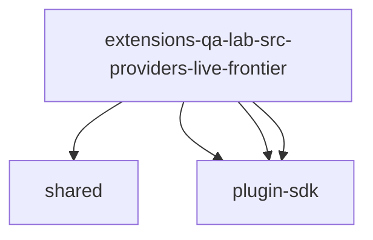

# Imports

[← Back to MODULE](MODULE.md) | [← Back to INDEX](../../INDEX.md)

## Dependency Graph

## External Dependencies

Dependencies from other modules:

- `../shared/auth-store.js`
- `openclaw/plugin-sdk/agent-runtime`
- `openclaw/plugin-sdk/provider-auth`
- `openclaw/plugin-sdk/string-coerce-runtime`
