# Imports

[← Back to MODULE](MODULE.md) | [← Back to INDEX](../../INDEX.md)

## Dependency Graph

```mermaid
graph TD
    extensions_qa_lab_src_providers_mock_openai[extensions-qa-lab-src-providers-mock-openai] --> __[..]
    extensions_qa_lab_src_providers_mock_openai[extensions-qa-lab-src-providers-mock-openai] --> __[..]
    extensions_qa_lab_src_providers_mock_openai[extensions-qa-lab-src-providers-mock-openai] --> shared[shared]
    extensions_qa_lab_src_providers_mock_openai[extensions-qa-lab-src-providers-mock-openai] --> shared[shared]
    extensions_qa_lab_src_providers_mock_openai[extensions-qa-lab-src-providers-mock-openai] --> shared[shared]
    extensions_qa_lab_src_providers_mock_openai[extensions-qa-lab-src-providers-mock-openai] --> shared[shared]
    extensions_qa_lab_src_providers_mock_openai[extensions-qa-lab-src-providers-mock-openai] --> _[.]
    extensions_qa_lab_src_providers_mock_openai[extensions-qa-lab-src-providers-mock-openai] --> _[.]
    extensions_qa_lab_src_providers_mock_openai[extensions-qa-lab-src-providers-mock-openai] --> _[.]
    extensions_qa_lab_src_providers_mock_openai[extensions-qa-lab-src-providers-mock-openai] --> _[.]
    extensions_qa_lab_src_providers_mock_openai[extensions-qa-lab-src-providers-mock-openai] --> _[.]
    extensions_qa_lab_src_providers_mock_openai[extensions-qa-lab-src-providers-mock-openai] --> _[.]
    extensions_qa_lab_src_providers_mock_openai[extensions-qa-lab-src-providers-mock-openai] --> _[.]
    extensions_qa_lab_src_providers_mock_openai[extensions-qa-lab-src-providers-mock-openai] --> _[.]
    extensions_qa_lab_src_providers_mock_openai[extensions-qa-lab-src-providers-mock-openai] --> _[.]
    extensions_qa_lab_src_providers_mock_openai[extensions-qa-lab-src-providers-mock-openai] --> node_crypto[node:crypto]
    extensions_qa_lab_src_providers_mock_openai[extensions-qa-lab-src-providers-mock-openai] --> node_http[node:http]
    extensions_qa_lab_src_providers_mock_openai[extensions-qa-lab-src-providers-mock-openai] --> node_timers[node:timers]
    extensions_qa_lab_src_providers_mock_openai[extensions-qa-lab-src-providers-mock-openai] --> plugin_sdk[plugin-sdk]
    extensions_qa_lab_src_providers_mock_openai[extensions-qa-lab-src-providers-mock-openai] --> plugin_sdk[plugin-sdk]
    extensions_qa_lab_src_providers_mock_openai[extensions-qa-lab-src-providers-mock-openai] --> vitest[vitest]
```

## External Dependencies

Dependencies from other modules:

- `../../bus-server.js`
- `../../qa-web-search-provider.js`
- `../shared/debug-request-cursor.js`
- `../shared/http-json.js`
- `../shared/mock-model-config.js`
- `../shared/mock-provider-definition.js`
- `./mock-anthropic-messages.js`
- `./mock-anthropic-wire.js`
- `./mock-openai-assistant-text.js`
- `./mock-openai-contracts.js`
- `./mock-openai-directives.js`
- `./mock-openai-events.js`
- `./mock-openai-input.js`
- `./mock-openai-tooling.js`
- `./server.js`
- `node:crypto`
- `node:http`
- `node:timers/promises`
- `openclaw/plugin-sdk/text-utility-runtime`
- `openclaw/plugin-sdk/webhook-ingress`
- `vitest`
