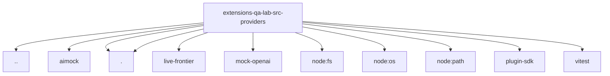

# Imports

[← Back to MODULE](MODULE.md) | [← Back to INDEX](../../INDEX.md)

## Dependency Graph

## External Dependencies

Dependencies from other modules:

- `../qa-gateway-config.js`
- `./aimock/index.js`
- `./image-generation.js`
- `./index.js`
- `./live-frontier/index.js`
- `./mock-openai/index.js`
- `node:fs`
- `node:os`
- `node:path`
- `openclaw/plugin-sdk/string-coerce-runtime`
- `vitest`
