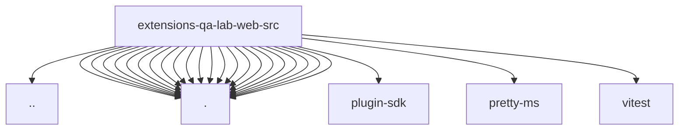

# Imports

[← Back to MODULE](MODULE.md) | [← Back to INDEX](../../INDEX.md)

## Dependency Graph

## External Dependencies

Dependencies from other modules:

- `../../model-selection.js`
- `./app.js`
- `./capture-saved-view.js`
- `./errors.js`
- `./http.js`
- `./styles.css`
- `./ui-conversation-key.js`
- `./ui-render-capture-controls.js`
- `./ui-render-capture-detail.js`
- `./ui-render-capture-events.js`
- `./ui-render-capture-format.js`
- `./ui-render-capture-model.js`
- `./ui-render-capture-redaction.js`
- `./ui-render-capture-summary.js`
- `./ui-render-capture-timeline-model.js`
- `./ui-render-capture-timeline.js`
- `./ui-render-capture-workspace.js`
- `./ui-render-capture.js`
- `./ui-render-evidence.js`
- `./ui-render-main.js`
- `./ui-render-scenario.js`
- `./ui-render-utils.js`
- `./ui-render.js`
- `openclaw/plugin-sdk/text-utility-runtime`
- `pretty-ms`
- `vitest`
