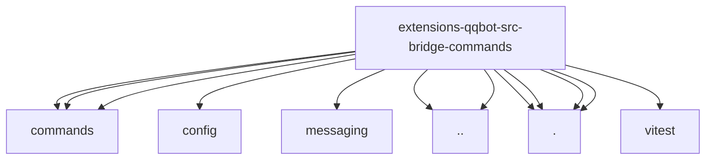

# Imports

[← Back to MODULE](MODULE.md) | [← Back to INDEX](../../INDEX.md)

## Dependency Graph

## External Dependencies

Dependencies from other modules:

- `../../engine/commands/command-visibility.js`
- `../../engine/commands/slash-command-test-support.js`
- `../../engine/commands/slash-commands-impl.js`
- `../../engine/config/group.js`
- `../../engine/messaging/outbound.js`
- `../bootstrap.js`
- `../config.js`
- `./framework-context-adapter.js`
- `./framework-registration.js`
- `./from-parser.js`
- `./result-dispatcher.js`
- `vitest`
