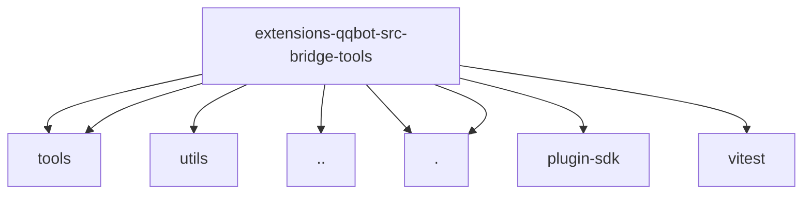

# Imports

[← Back to MODULE](MODULE.md) | [← Back to INDEX](../../INDEX.md)

## Dependency Graph

## External Dependencies

Dependencies from other modules:

- `../../engine/tools/channel-api.js`
- `../../engine/tools/remind-logic.js`
- `../../engine/utils/request-context.js`
- `../config.js`
- `./channel.js`
- `./remind.js`
- `openclaw/plugin-sdk/agent-harness-runtime`
- `vitest`
