# Imports

[← Back to MODULE](MODULE.md) | [← Back to INDEX](../../INDEX.md)

## Dependency Graph

```mermaid
graph TD
    extensions_qqbot_src_engine_api[extensions-qqbot-src-engine-api] --> test_support[test-support]
    extensions_qqbot_src_engine_api[extensions-qqbot-src-engine-api] --> messaging[messaging]
    extensions_qqbot_src_engine_api[extensions-qqbot-src-engine-api] --> __[..]
    extensions_qqbot_src_engine_api[extensions-qqbot-src-engine-api] --> utils[utils]
    extensions_qqbot_src_engine_api[extensions-qqbot-src-engine-api] --> utils[utils]
    extensions_qqbot_src_engine_api[extensions-qqbot-src-engine-api] --> _[.]
    extensions_qqbot_src_engine_api[extensions-qqbot-src-engine-api] --> _[.]
    extensions_qqbot_src_engine_api[extensions-qqbot-src-engine-api] --> _[.]
    extensions_qqbot_src_engine_api[extensions-qqbot-src-engine-api] --> _[.]
    extensions_qqbot_src_engine_api[extensions-qqbot-src-engine-api] --> _[.]
    extensions_qqbot_src_engine_api[extensions-qqbot-src-engine-api] --> _[.]
    extensions_qqbot_src_engine_api[extensions-qqbot-src-engine-api] --> node_events[node:events]
    extensions_qqbot_src_engine_api[extensions-qqbot-src-engine-api] --> plugin_sdk[plugin-sdk]
    extensions_qqbot_src_engine_api[extensions-qqbot-src-engine-api] --> plugin_sdk[plugin-sdk]
    extensions_qqbot_src_engine_api[extensions-qqbot-src-engine-api] --> plugin_sdk[plugin-sdk]
    extensions_qqbot_src_engine_api[extensions-qqbot-src-engine-api] --> plugin_sdk[plugin-sdk]
    extensions_qqbot_src_engine_api[extensions-qqbot-src-engine-api] --> plugin_sdk[plugin-sdk]
    extensions_qqbot_src_engine_api[extensions-qqbot-src-engine-api] --> plugin_sdk[plugin-sdk]
    extensions_qqbot_src_engine_api[extensions-qqbot-src-engine-api] --> plugin_sdk[plugin-sdk]
    extensions_qqbot_src_engine_api[extensions-qqbot-src-engine-api] --> p_map[p-map]
    extensions_qqbot_src_engine_api[extensions-qqbot-src-engine-api] --> vitest[vitest]
```

## External Dependencies

Dependencies from other modules:

- `../../../../test-support/streaming-error-response.js`
- `../messaging/media-source.js`
- `../types.js`
- `../utils/file-utils.js`
- `../utils/format.js`
- `./api-client.js`
- `./media-chunked.js`
- `./media.js`
- `./retry.js`
- `./routes.js`
- `./token.js`
- `node:events`
- `openclaw/plugin-sdk/number-runtime`
- `openclaw/plugin-sdk/provider-http`
- `openclaw/plugin-sdk/response-limit-runtime`
- `openclaw/plugin-sdk/retry-runtime`
- `openclaw/plugin-sdk/runtime-env`
- `openclaw/plugin-sdk/ssrf-runtime`
- `openclaw/plugin-sdk/text-utility-runtime`
- `p-map`
- `vitest`
